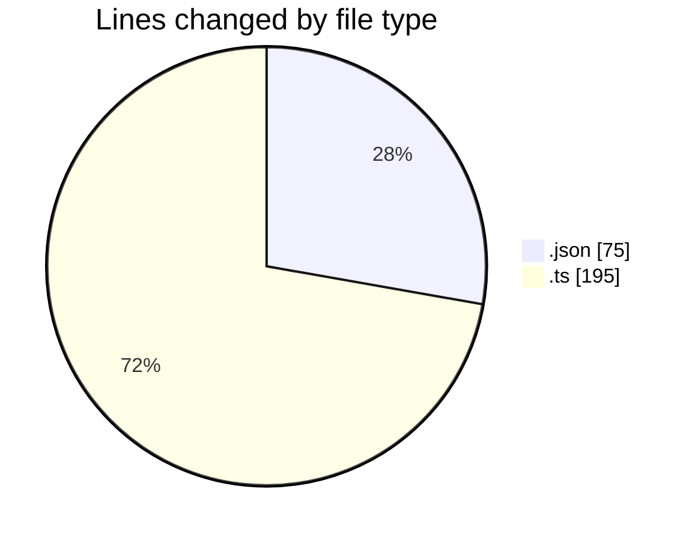
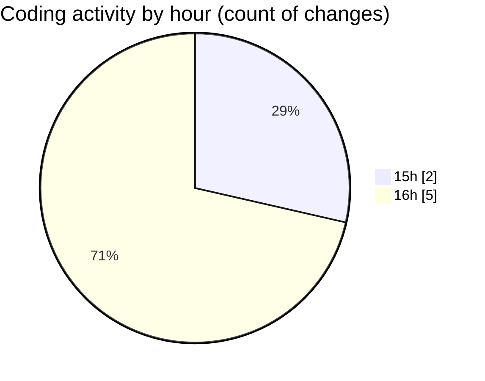

# ise-web-ofcom - Activity Summary 

## Overall Statistics

| Stat                   | Value                                                             |
| ---------------------- | ----------------------------------------------------------------- |
| **Lines Added** (➕)   | 270                                          |
| **Lines Removed** (➖) | 0                                        |
| **Net Change** (↕)    | 270                |
| **Active Time** (⌚)   | 4 minutes |

## Modified Files
- **settings.json** (+75, -0)
- **queries.ts** (+77, -0)
- **mutations.ts** (+81, -0)
- **codegen.ts** (+37, -0)

## Visualizations

### By File Type (Lines Changed)

### By Hour (Estimated Activity Count)

> **Last Updated:** 21/04/2026, 16:40:04