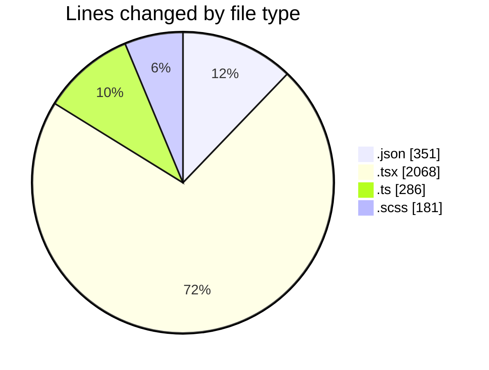
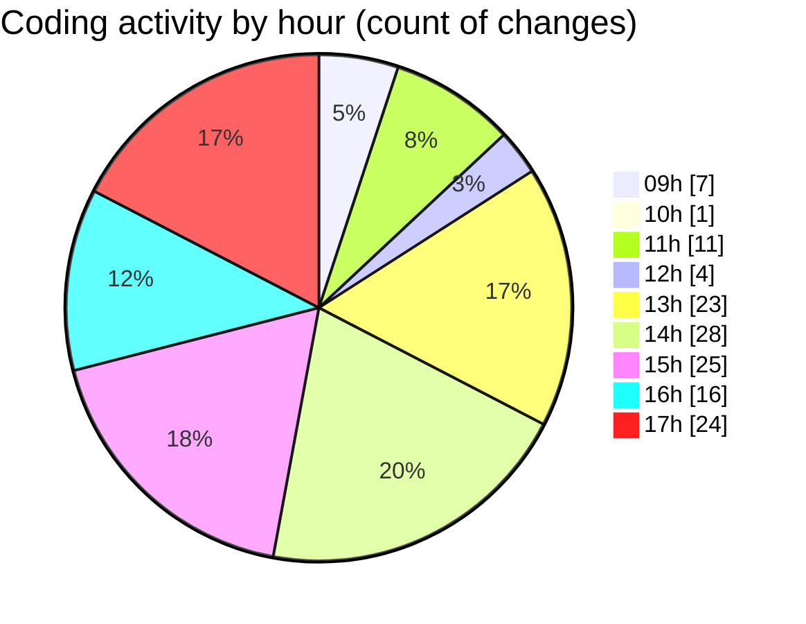

# cda - Activity Summary 

## Overall Statistics

| Stat                   | Value                                                             |
| ---------------------- | ----------------------------------------------------------------- |
| **Lines Added** (➕)   | 2603                                          |
| **Lines Removed** (➖) | 283                                        |
| **Net Change** (↕)    | 2320                |
| **Active Time** (⌚)   | 186 minutes |

## Modified Files
- **settings.json** (+160, -0)
- **.skill-lock.json** (+97, -0)
- **keybindings.json** (+8, -0)
- **SearchLds.tsx** (+743, -43)
- **Lds.tsx** (+633, -200)
- **SearchLds.test.tsx** (+26, -1)
- **queries.ts** (+154, -0)
- **SearchLds.scss** (+96, -0)
- **App.scss** (+38, -6)
- **Lds.scss** (+22, -6)
- **lds.tsx** (+145, -0)
- **mutations.ts** (+82, -1)
- **types.d.ts** (+42, -0)
- **package.json** (+63, -0)
- **tsconfig.json** (+23, -0)
- **App.tsx** (+45, -0)
- **setupTests.ts** (+7, -0)
- **Lds.test.tsx** (+38, -0)
- **ErrorBox.tsx** (+65, -26)
- **ErrorCard.test.tsx** (+51, -0)
- **ErrorBox.scss** (+13, -0)
- **ErrorBox.test.tsx** (+52, -0)

## Visualizations

### By File Type (Lines Changed)

### By Hour (Estimated Activity Count)

> **Last Updated:** 22/04/2026, 17:45:23