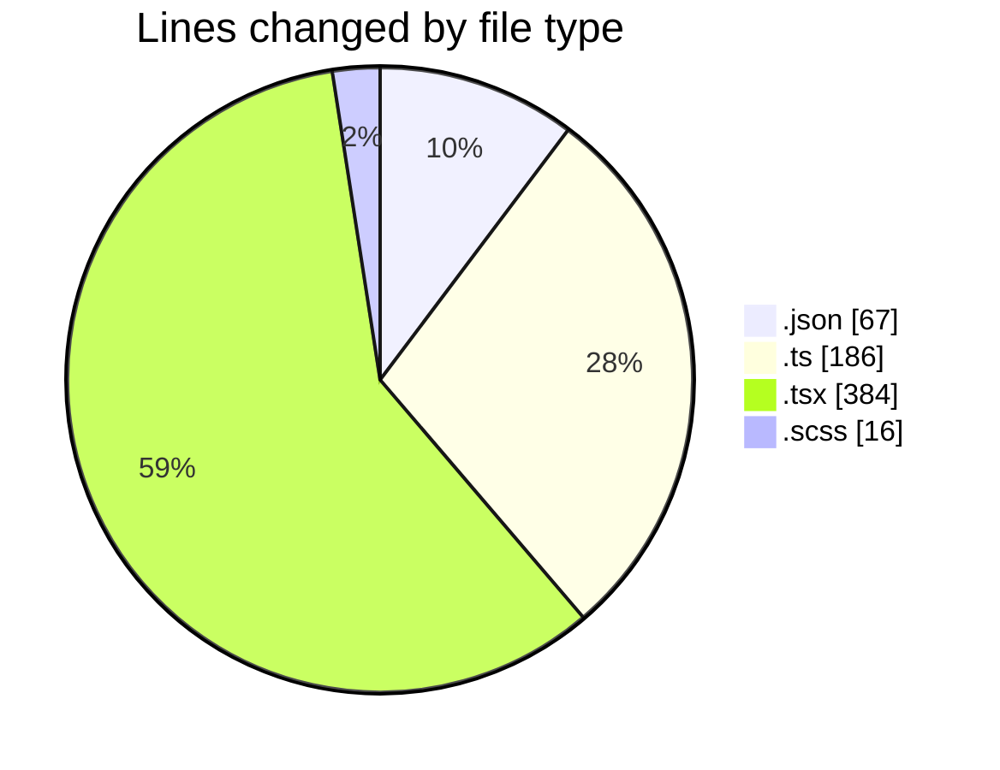
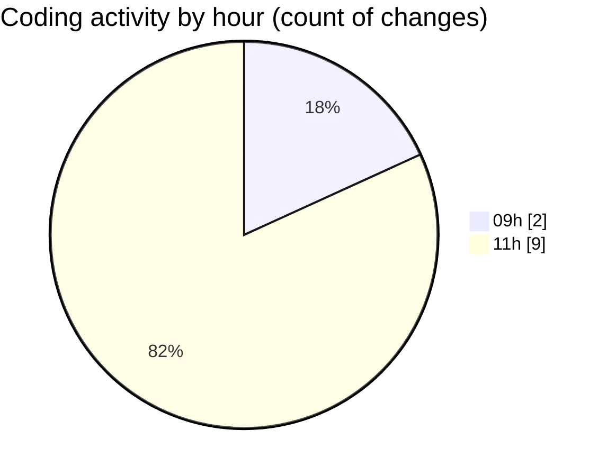

# ise-web-ofcom - Activity Summary 

## Overall Statistics

| Stat                   | Value                                                             |
| ---------------------- | ----------------------------------------------------------------- |
| **Lines Added** (➕)   | 653                                          |
| **Lines Removed** (➖) | 0                                        |
| **Net Change** (↕)    | 653                |
| **Active Time** (⌚)   | 9 minutes |

## Modified Files
- **settings.json** (+4, -0)
- **mutations.ts** (+81, -0)
- **codegen.ts** (+28, -0)
- **queries.ts** (+77, -0)
- **SearchLds.tsx** (+127, -0)
- **SearchLds.scss** (+16, -0)
- **Lds.test.tsx** (+36, -0)
- **Lds.tsx** (+101, -0)
- **SearchLds.test.tsx** (+120, -0)
- **package.json** (+63, -0)

## Visualizations

### By File Type (Lines Changed)

### By Hour (Estimated Activity Count)

> **Last Updated:** 22/04/2026, 11:08:58