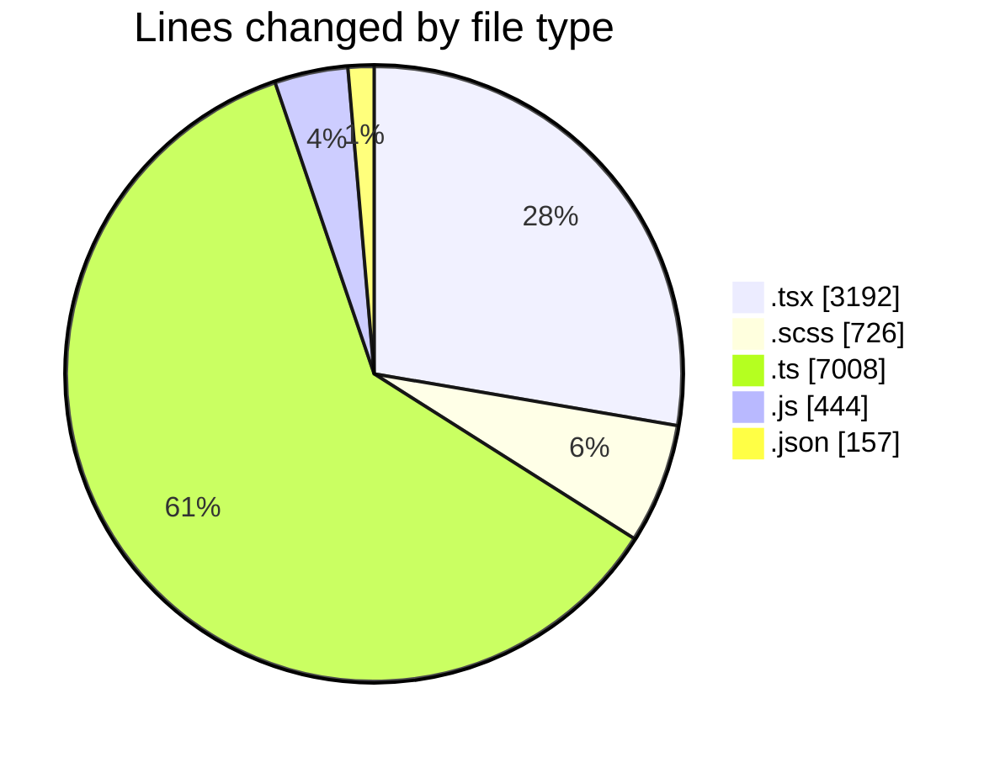
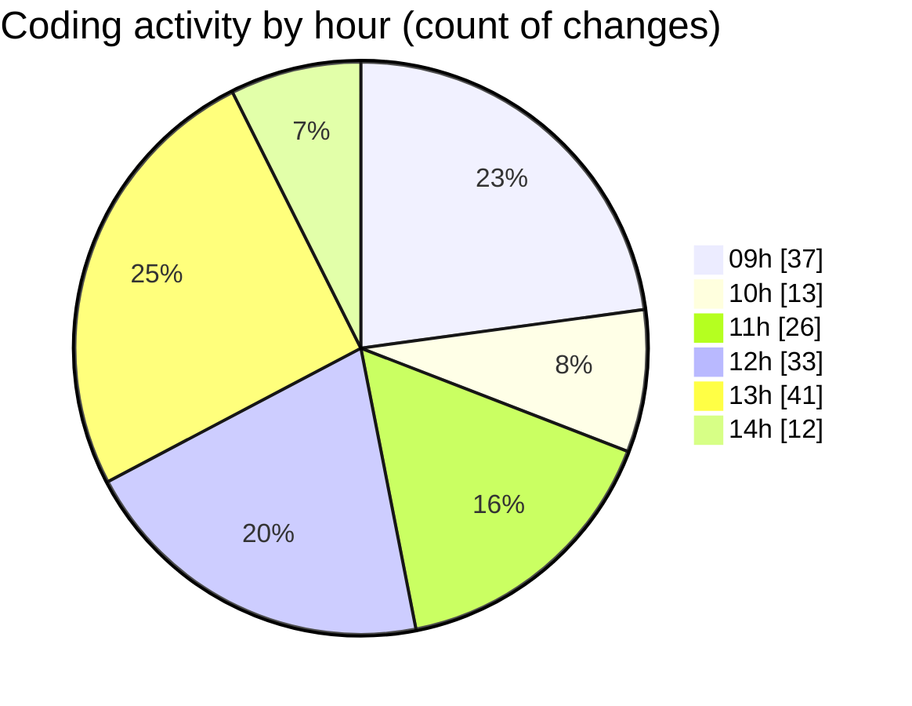

# cda - Activity Summary 

## Overall Statistics

| Stat                   | Value                                                             |
| ---------------------- | ----------------------------------------------------------------- |
| **Lines Added** (➕)   | 10649                                          |
| **Lines Removed** (➖) | 878                                        |
| **Net Change** (↕)    | 9771                |
| **Active Time** (⌚)   | 239 minutes |

## Modified Files
- **SearchLds.tsx** (+989, -657)
- **Lds.tsx** (+421, -0)
- **Lds.test.tsx** (+257, -0)
- **ErrorBox.tsx** (+125, -0)
- **ErrorBox.test.tsx** (+186, -0)
- **LdsList.tsx** (+369, -64)
- **SearchLds.scss** (+405, -126)
- **LdsList.scss** (+171, -24)
- **mutations.ts** (+243, -0)
- **OfcomReportingEventRepository.js** (+379, -2)
- **.eslintrc.js** (+58, -5)
- **package.json** (+63, -0)
- **setupProxy.ts** (+8, -0)
- **index.tsx** (+18, -0)
- **App.tsx** (+92, -0)
- **manifest.json** (+42, -0)
- **tsconfig.json** (+26, -0)
- **tsconfig.json** (+26, -0)
- **setupTests.ts** (+8, -0)
- **SearchMessage.tsx** (+14, -0)
- **graphql.ts** (+6731, -0)
- **formaters.ts** (+18, -0)

## Visualizations

### By File Type (Lines Changed)

### By Hour (Estimated Activity Count)

> **Last Updated:** 23/04/2026, 14:08:30