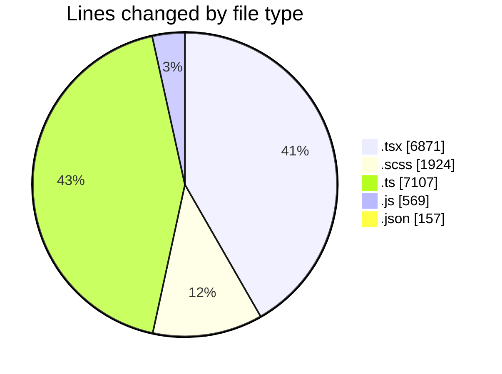
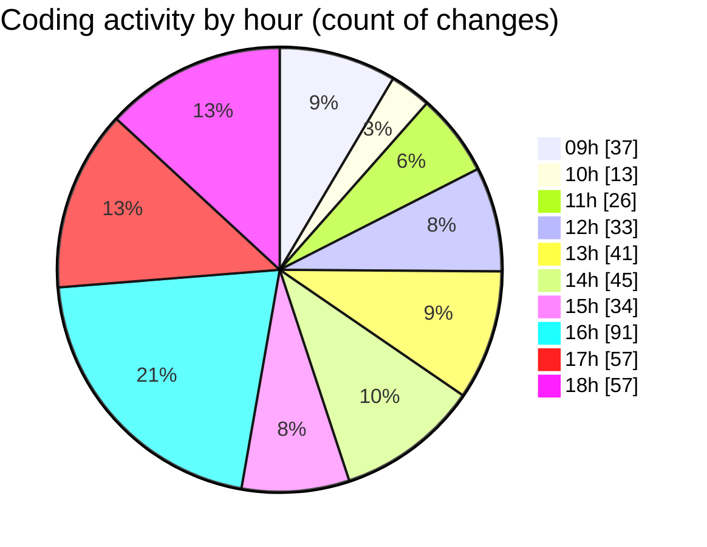

# cda - Activity Summary 

## Overall Statistics

| Stat                   | Value                                                             |
| ---------------------- | ----------------------------------------------------------------- |
| **Lines Added** (➕)   | 14724                                          |
| **Lines Removed** (➖) | 1904                                        |
| **Net Change** (↕)    | 12820                |
| **Active Time** (⌚)   | 601 minutes |

## Modified Files
- **SearchLds.tsx** (+1486, -907)
- **Lds.tsx** (+707, -0)
- **Lds.test.tsx** (+343, -0)
- **ErrorBox.tsx** (+167, -0)
- **ErrorBox.test.tsx** (+248, -0)
- **LdsList.tsx** (+807, -137)
- **SearchLds.scss** (+428, -126)
- **LdsList.scss** (+910, -460)
- **mutations.ts** (+324, -0)
- **OfcomReportingEventRepository.js** (+504, -2)
- **.eslintrc.js** (+58, -5)
- **package.json** (+63, -0)
- **setupProxy.ts** (+8, -0)
- **index.tsx** (+37, -0)
- **App.tsx** (+92, -0)
- **manifest.json** (+42, -0)
- **tsconfig.json** (+26, -0)
- **tsconfig.json** (+26, -0)
- **setupTests.ts** (+8, -0)
- **SearchMessage.tsx** (+14, -0)
- **graphql.ts** (+6731, -0)
- **formaters.ts** (+30, -6)
- **SearchLds.test.tsx** (+324, -0)
- **LdsLis.test.tsx** (+738, -259)
- **FindUser.tsx** (+84, -0)
- **LdsList.test.tsx** (+519, -2)

## Visualizations

### By File Type (Lines Changed)

### By Hour (Estimated Activity Count)

> **Last Updated:** 23/04/2026, 18:57:53