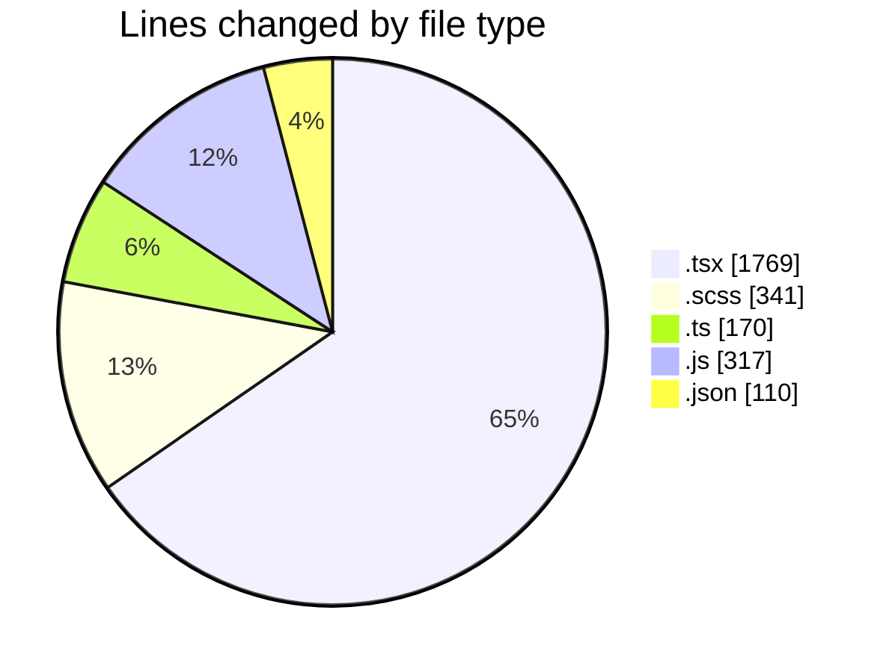
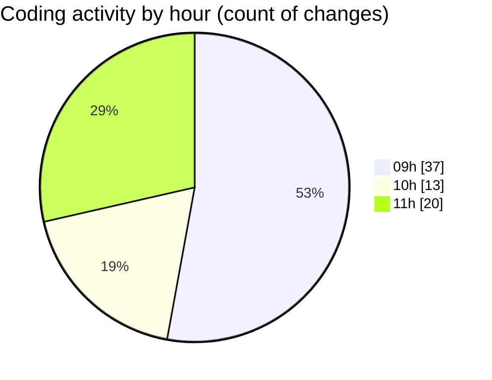

# cda - Activity Summary 

## Overall Statistics

| Stat                   | Value                                                             |
| ---------------------- | ----------------------------------------------------------------- |
| **Lines Added** (➕)   | 2353                                          |
| **Lines Removed** (➖) | 354                                        |
| **Net Change** (↕)    | 1999                |
| **Active Time** (⌚)   | 112 minutes |

## Modified Files
- **SearchLds.tsx** (+565, -349)
- **Lds.tsx** (+280, -0)
- **Lds.test.tsx** (+171, -0)
- **ErrorBox.tsx** (+83, -0)
- **ErrorBox.test.tsx** (+124, -0)
- **LdsList.tsx** (+133, -0)
- **SearchLds.scss** (+270, -0)
- **LdsList.scss** (+71, -0)
- **mutations.ts** (+162, -0)
- **OfcomReportingEventRepository.js** (+254, -0)
- **.eslintrc.js** (+58, -5)
- **package.json** (+63, -0)
- **setupProxy.ts** (+8, -0)
- **index.tsx** (+18, -0)
- **App.tsx** (+46, -0)
- **manifest.json** (+21, -0)
- **tsconfig.json** (+26, -0)

## Visualizations

### By File Type (Lines Changed)

### By Hour (Estimated Activity Count)

> **Last Updated:** 23/04/2026, 11:44:01