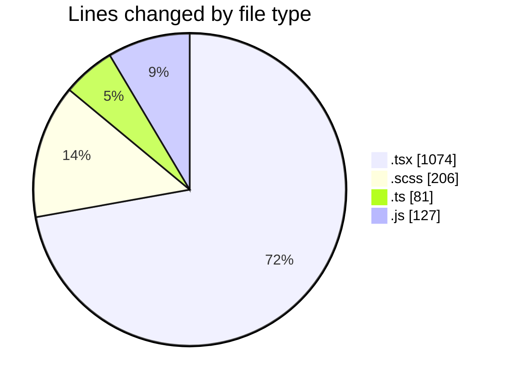
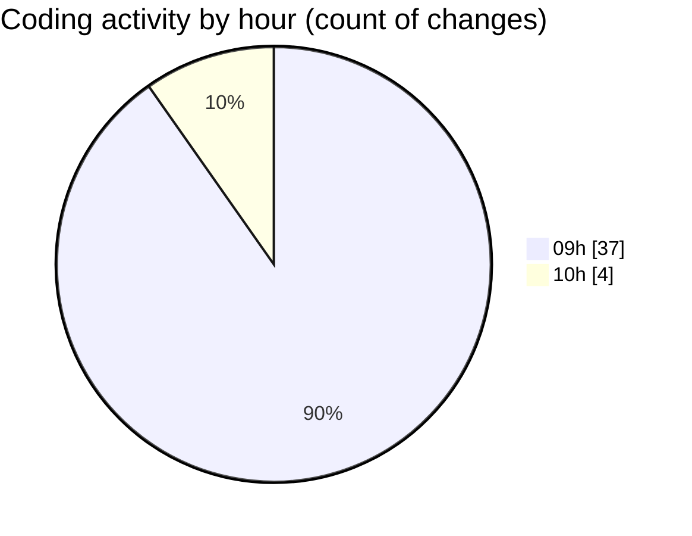

# cda - Activity Summary 

## Overall Statistics

| Stat                   | Value                                                             |
| ---------------------- | ----------------------------------------------------------------- |
| **Lines Added** (➕)   | 1143                                          |
| **Lines Removed** (➖) | 345                                        |
| **Net Change** (↕)    | 798                |
| **Active Time** (⌚)   | 69 minutes |

## Modified Files
- **SearchLds.tsx** (+336, -345)
- **Lds.tsx** (+139, -0)
- **Lds.test.tsx** (+85, -0)
- **ErrorBox.tsx** (+41, -0)
- **ErrorBox.test.tsx** (+62, -0)
- **LdsList.tsx** (+66, -0)
- **SearchLds.scss** (+135, -0)
- **LdsList.scss** (+71, -0)
- **mutations.ts** (+81, -0)
- **OfcomReportingEventRepository.js** (+127, -0)

## Visualizations

### By File Type (Lines Changed)

### By Hour (Estimated Activity Count)

> **Last Updated:** 23/04/2026, 10:10:32