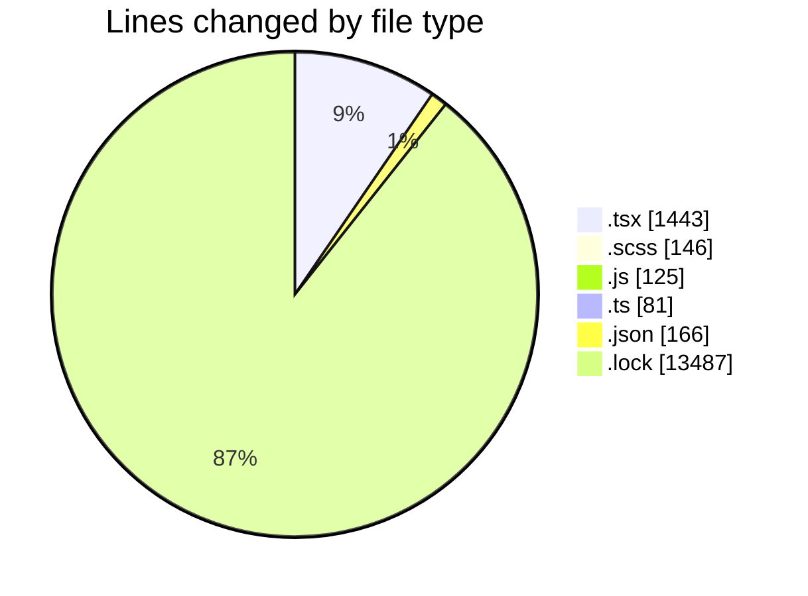
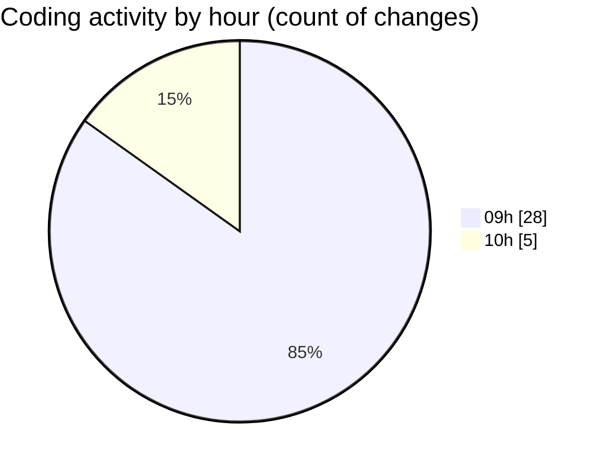

# cda - Activity Summary 

## Overall Statistics

| Stat                   | Value                                                             |
| ---------------------- | ----------------------------------------------------------------- |
| **Lines Added** (➕)   | 15428                                          |
| **Lines Removed** (➖) | 20                                        |
| **Net Change** (↕)    | 15408                |
| **Active Time** (⌚)   | 49 minutes |

## Modified Files
- **Lds.tsx** (+302, -1)
- **Lds.test.tsx** (+73, -0)
- **ErrorBox.tsx** (+81, -3)
- **ErrorBox.test.tsx** (+62, -0)
- **LdsList.tsx** (+173, -0)
- **SearchLds.tsx** (+256, -0)
- **SearchLds.scss** (+16, -0)
- **OfcomReportingEventRepository.js** (+125, -0)
- **mutations.ts** (+81, -0)
- **LdsList.test.tsx** (+259, -0)
- **SearchLds.test.tsx** (+149, -0)
- **LdsList.scss** (+130, -0)
- **package.json** (+150, -16)
- **FindUser.tsx** (+84, -0)
- **yarn.lock** (+13487, -0)

## Visualizations

### By File Type (Lines Changed)

### By Hour (Estimated Activity Count)

> **Last Updated:** 24/04/2026, 10:22:04