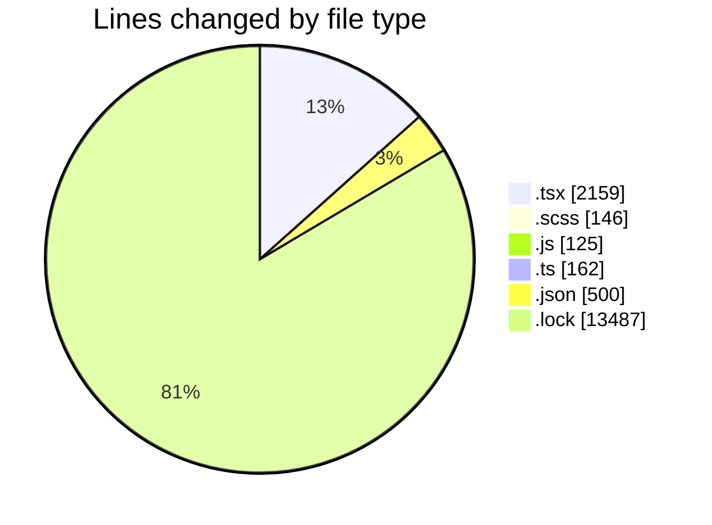
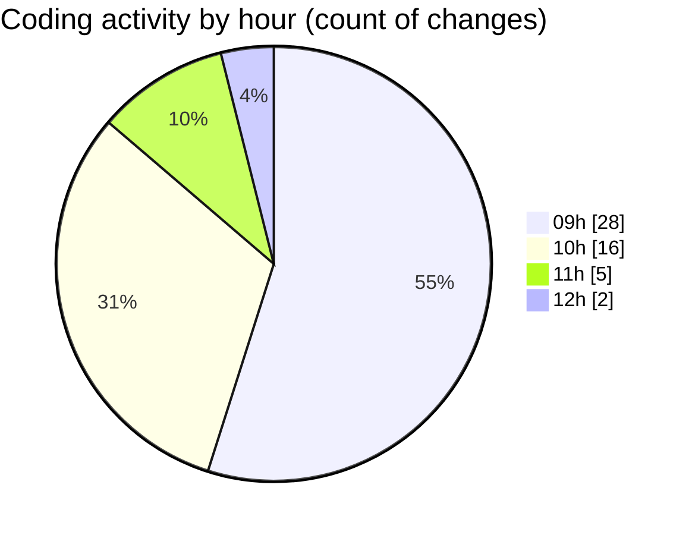

# cda - Activity Summary 

## Overall Statistics

| Stat                   | Value                                                             |
| ---------------------- | ----------------------------------------------------------------- |
| **Lines Added** (➕)   | 16556                                          |
| **Lines Removed** (➖) | 23                                        |
| **Net Change** (↕)    | 16533                |
| **Active Time** (⌚)   | 57 minutes |

## Modified Files
- **Lds.tsx** (+452, -1)
- **Lds.test.tsx** (+146, -0)
- **ErrorBox.tsx** (+81, -3)
- **ErrorBox.test.tsx** (+62, -0)
- **LdsList.tsx** (+346, -0)
- **SearchLds.tsx** (+256, -0)
- **SearchLds.scss** (+16, -0)
- **OfcomReportingEventRepository.js** (+125, -0)
- **mutations.ts** (+162, -0)
- **LdsList.test.tsx** (+521, -3)
- **SearchLds.test.tsx** (+149, -0)
- **LdsList.scss** (+130, -0)
- **package.json** (+217, -16)
- **FindUser.tsx** (+84, -0)
- **yarn.lock** (+13487, -0)
- **package.json** (+81, -0)
- **package.json** (+186, -0)
- **App.tsx** (+55, -0)

## Visualizations

### By File Type (Lines Changed)

### By Hour (Estimated Activity Count)

> **Last Updated:** 24/04/2026, 12:15:49