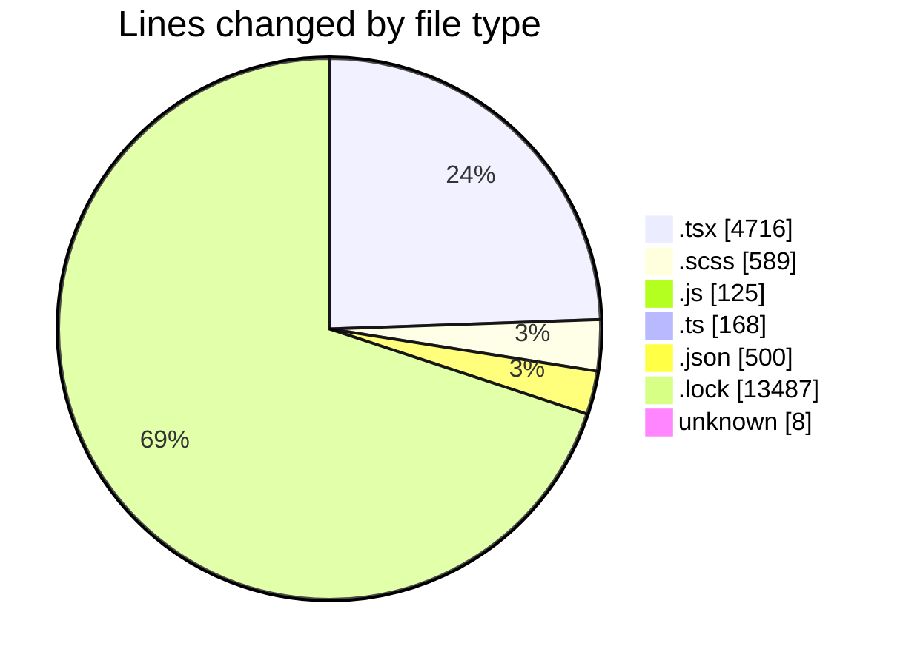
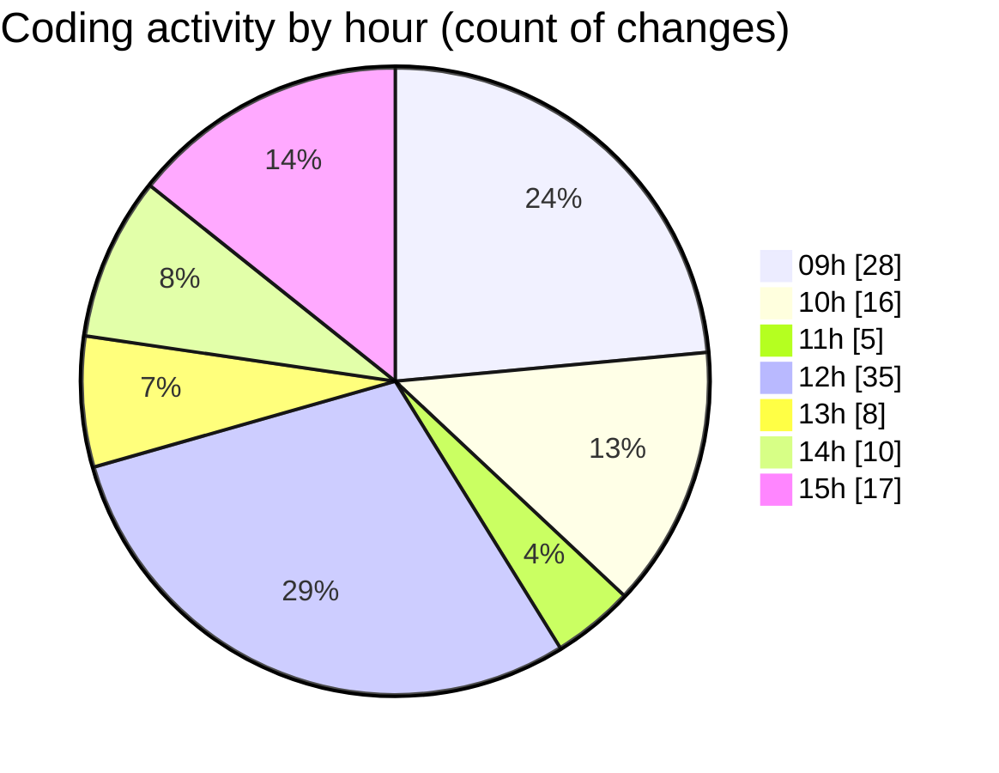

# cda - Activity Summary 

## Overall Statistics

| Stat                   | Value                                                             |
| ---------------------- | ----------------------------------------------------------------- |
| **Lines Added** (➕)   | 18788                                          |
| **Lines Removed** (➖) | 805                                        |
| **Net Change** (↕)    | 17983                |
| **Active Time** (⌚)   | 149 minutes |

## Modified Files
- **Lds.tsx** (+452, -1)
- **Lds.test.tsx** (+146, -0)
- **ErrorBox.tsx** (+81, -3)
- **ErrorBox.test.tsx** (+62, -0)
- **LdsList.tsx** (+346, -0)
- **SearchLds.tsx** (+256, -0)
- **SearchLds.scss** (+16, -0)
- **OfcomReportingEventRepository.js** (+125, -0)
- **mutations.ts** (+162, -0)
- **LdsList.test.tsx** (+521, -3)
- **SearchLds.test.tsx** (+149, -0)
- **LdsList.scss** (+130, -0)
- **package.json** (+217, -16)
- **FindUser.tsx** (+84, -0)
- **yarn.lock** (+13487, -0)
- **package.json** (+81, -0)
- **package.json** (+186, -0)
- **App.tsx** (+71, -5)
- **PsbSummary.tsx** (+527, -198)
- **index.ts** (+3, -0)
- **PsbSummary.scss** (+47, -43)
- **SearchLds.tsx** (+128, -0)
- **SummaryReport.tsx** (+182, -35)
- **LdsSearch.test.tsx** (+149, -0)
- **index.ts** (+3, -0)
- **LdsSearch.tsx** (+128, -0)
- **SummaryReport.test.tsx** (+461, -176)
- **PsbSummary.test.tsx** (+404, -148)
- **SummaryReport.scss** (+177, -176)
- **.gitignore** (+7, -1)

## Visualizations

### By File Type (Lines Changed)

### By Hour (Estimated Activity Count)

> **Last Updated:** 24/04/2026, 15:48:07