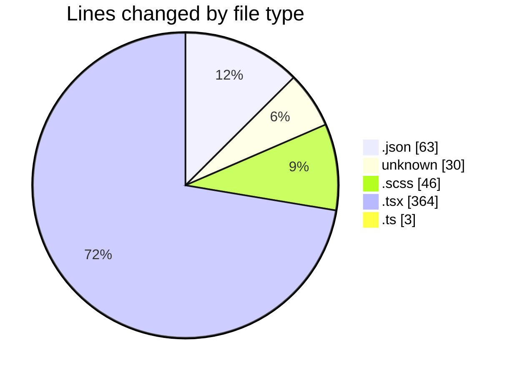
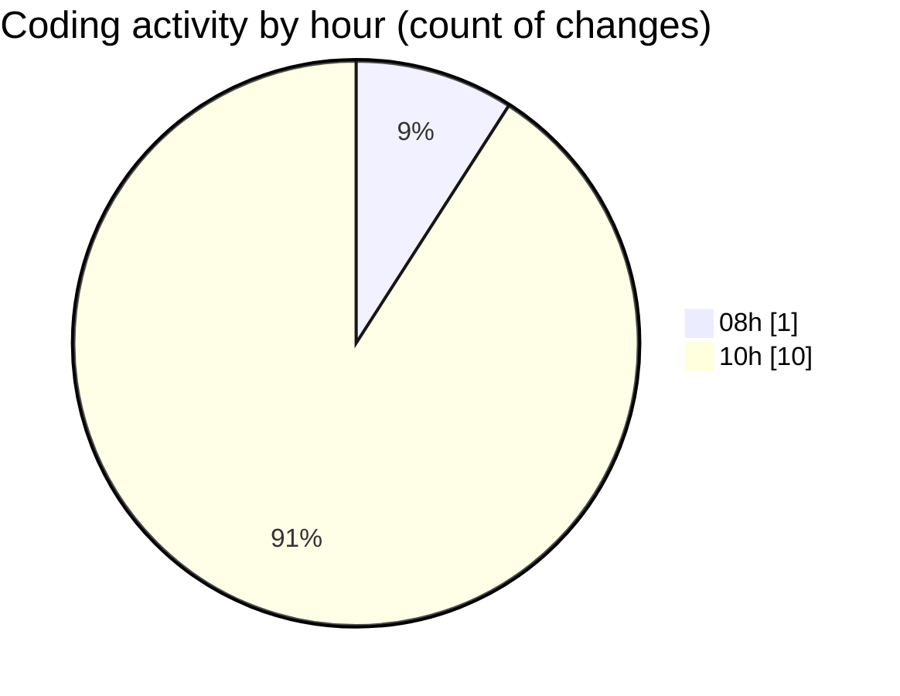

# ise-web-ofcom - Activity Summary 

## Overall Statistics

| Stat                   | Value                                                             |
| ---------------------- | ----------------------------------------------------------------- |
| **Lines Added** (➕)   | 506                                          |
| **Lines Removed** (➖) | 0                                        |
| **Net Change** (↕)    | 506                |
| **Active Time** (⌚)   | 10 minutes |

## Modified Files
- **package.json** (+63, -0)
- **.gitignore** (+30, -0)
- **Summary.scss** (+46, -0)
- **Summary.tsx** (+188, -0)
- **App.tsx** (+54, -0)
- **index.ts** (+3, -0)
- **Summary.test.tsx** (+122, -0)

## Visualizations

### By File Type (Lines Changed)

### By Hour (Estimated Activity Count)

> **Last Updated:** 24/04/2026, 10:41:35