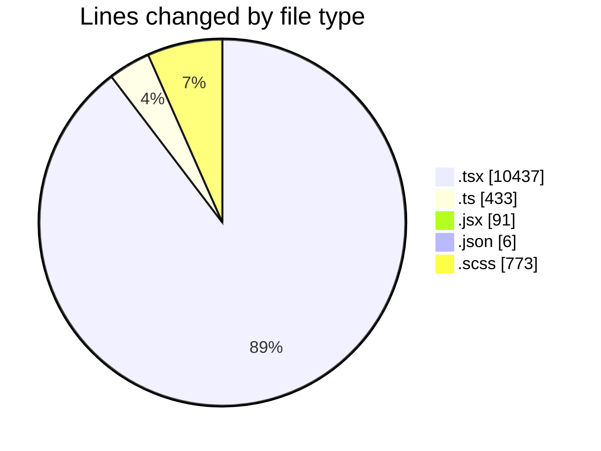
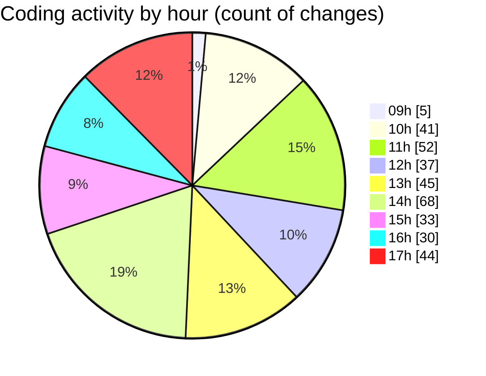

# cda - Activity Summary 

## Overall Statistics

| Stat                   | Value                                                             |
| ---------------------- | ----------------------------------------------------------------- |
| **Lines Added** (➕)   | 10769                                          |
| **Lines Removed** (➖) | 971                                        |
| **Net Change** (↕)    | 9798                |
| **Active Time** (⌚)   | 495 minutes |

## Modified Files
- **SummaryReport.test.tsx** (+974, -91)
- **LdsSearch.tsx** (+530, -77)
- **ofcomConnectionDefaults.ts** (+171, -0)
- **Lds.tsx** (+981, -174)
- **PsbSummary.tsx** (+835, -73)
- **SummaryReport.tsx** (+1014, -108)
- **ofcomConnectionDefaults.test.ts** (+72, -3)
- **PsbSummary.test.tsx** (+1310, -78)
- **Lds.test.tsx** (+453, -84)
- **LdsSearch.test.tsx** (+756, -83)
- **ConfirmRemoveModal.jsx** (+91, -0)
- **App.tsx** (+283, -28)
- **LdsList.tsx** (+523, -14)
- **ofcomConnections.ts** (+57, -0)
- **ofcomConnections.test.ts** (+24, -3)
- **getConnections.test.ts** (+21, -0)
- **ofcomConnectionsContext.ts** (+25, -0)
- **OfcomConnectionsProvider.tsx** (+65, -5)
- **index.ts** (+5, -0)
- **settings.json** (+6, -0)
- **LdsList.scss** (+402, -17)
- **LdsList.test.tsx** (+773, -2)
- **SummaryReport.scss** (+84, -24)
- **LdsSearch.scss** (+31, -13)
- **Lds.scss** (+14, -6)
- **App.scss** (+38, -0)
- **PsbSummary.scss** (+9, -1)
- **types.d.ts** (+36, -0)
- **index.tsx** (+3, -0)
- **ImportActions.tsx** (+318, -56)
- **ImportActions.scss** (+116, -2)
- **index.ts** (+8, -0)
- **Import.tsx** (+369, -29)
- **Import.scss** (+16, -0)
- **index.ts** (+8, -0)
- **Import.test.tsx** (+148, -0)
- **PsbSummary.submission.test.tsx** (+200, -0)

## Visualizations

### By File Type (Lines Changed)

### By Hour (Estimated Activity Count)

> **Last Updated:** 27/04/2026, 17:39:01