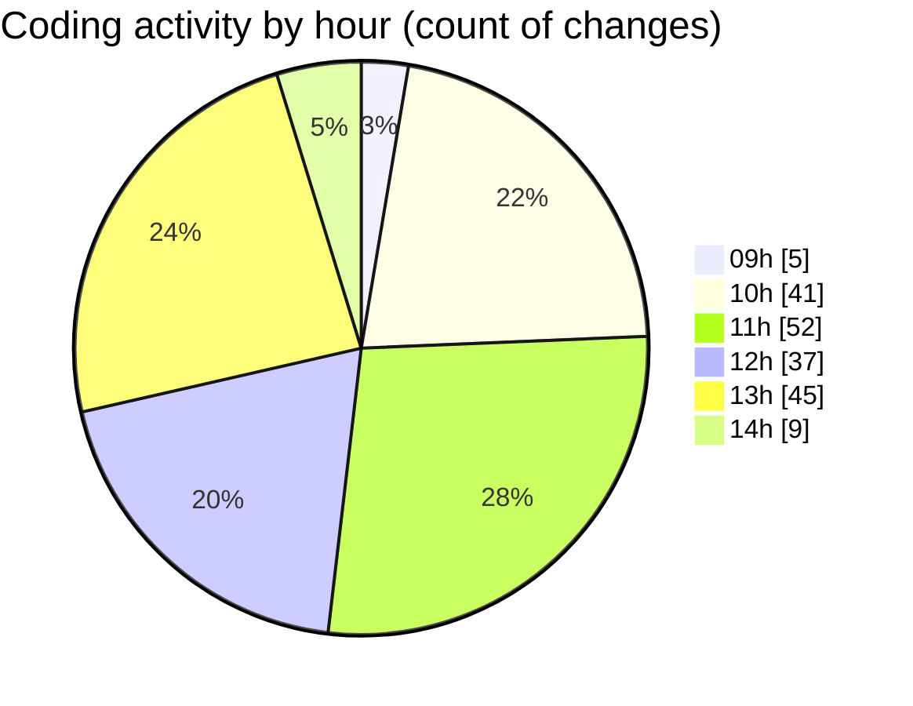

# cda - Activity Summary 

## Overall Statistics

| Stat                   | Value                                                             |
| ---------------------- | ----------------------------------------------------------------- |
| **Lines Added** (➕)   | 7404                                          |
| **Lines Removed** (➖) | 422                                        |
| **Net Change** (↕)    | 6982                |
| **Active Time** (⌚)   | 272 minutes |

## Modified Files
- **SummaryReport.test.tsx** (+810, -42)
- **LdsSearch.tsx** (+439, -71)
- **ofcomConnectionDefaults.ts** (+171, -0)
- **Lds.tsx** (+672, -27)
- **PsbSummary.tsx** (+676, -51)
- **SummaryReport.tsx** (+804, -56)
- **ofcomConnectionDefaults.test.ts** (+72, -3)
- **PsbSummary.test.tsx** (+1085, -3)
- **Lds.test.tsx** (+318, -22)
- **LdsSearch.test.tsx** (+612, -83)
- **ConfirmRemoveModal.jsx** (+91, -0)
- **App.tsx** (+195, -8)
- **LdsList.tsx** (+354, -14)
- **ofcomConnections.ts** (+57, -0)
- **ofcomConnections.test.ts** (+24, -3)
- **getConnections.test.ts** (+21, -0)
- **ofcomConnectionsContext.ts** (+25, -0)
- **OfcomConnectionsProvider.tsx** (+65, -5)
- **index.ts** (+5, -0)
- **settings.json** (+6, -0)
- **LdsList.scss** (+277, -17)
- **LdsList.test.tsx** (+516, -2)
- **SummaryReport.scss** (+32, -0)
- **LdsSearch.scss** (+25, -9)
- **Lds.scss** (+14, -6)
- **App.scss** (+38, -0)

## Visualizations

### By File Type (Lines Changed)

### By Hour (Estimated Activity Count)

> **Last Updated:** 27/04/2026, 14:07:53