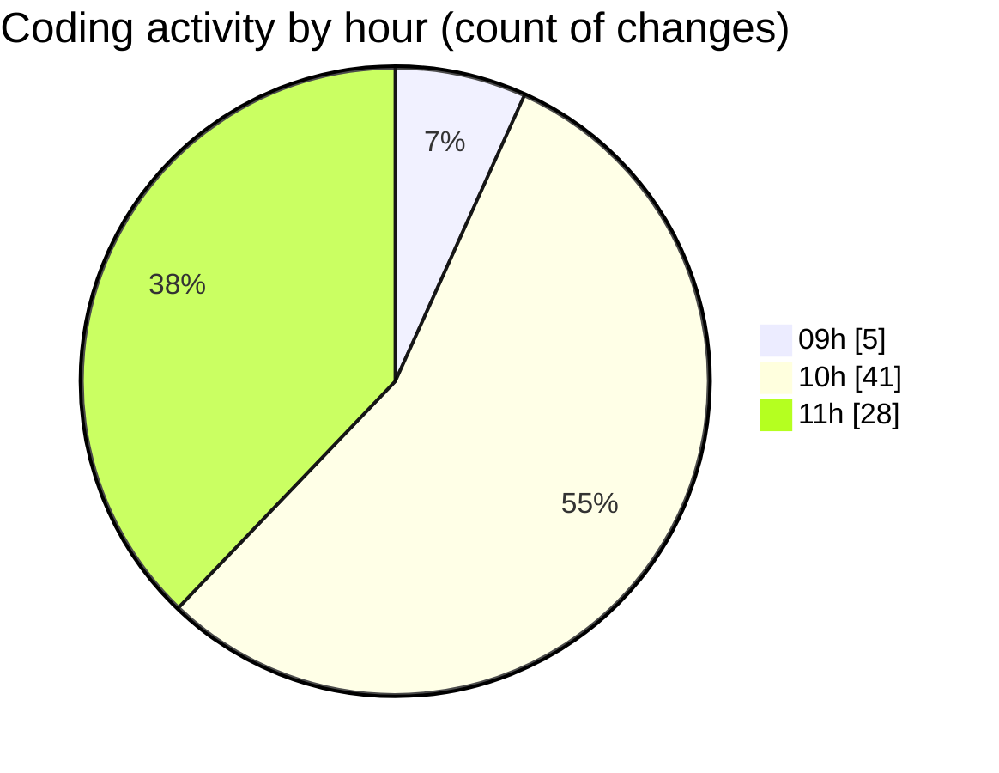

# cda - Activity Summary 

## Overall Statistics

| Stat                   | Value                                                             |
| ---------------------- | ----------------------------------------------------------------- |
| **Lines Added** (➕)   | 4062                                          |
| **Lines Removed** (➖) | 91                                        |
| **Net Change** (↕)    | 3971                |
| **Active Time** (⌚)   | 109 minutes |

## Modified Files
- **SummaryReport.test.tsx** (+426, -0)
- **LdsSearch.tsx** (+335, -55)
- **ofcomConnectionDefaults.ts** (+171, -0)
- **Lds.tsx** (+509, -1)
- **PsbSummary.tsx** (+536, -0)
- **SummaryReport.tsx** (+430, -0)
- **ofcomConnectionDefaults.test.ts** (+72, -3)
- **PsbSummary.test.tsx** (+534, -0)
- **Lds.test.tsx** (+236, -21)
- **LdsSearch.test.tsx** (+377, -1)
- **ConfirmRemoveModal.jsx** (+91, -0)
- **App.tsx** (+66, -7)
- **LdsList.tsx** (+177, -0)
- **ofcomConnections.ts** (+57, -0)
- **ofcomConnections.test.ts** (+24, -3)
- **getConnections.test.ts** (+21, -0)

## Visualizations

### By File Type (Lines Changed)

### By Hour (Estimated Activity Count)

> **Last Updated:** 27/04/2026, 11:43:22