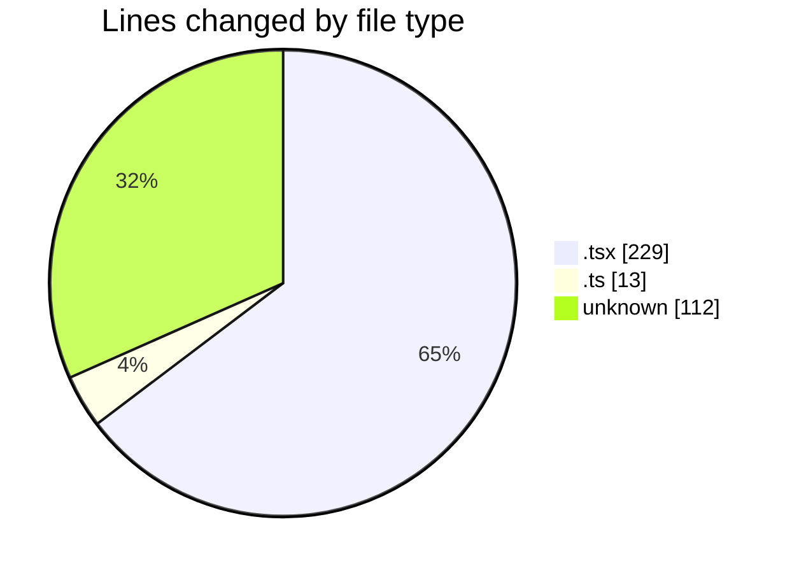
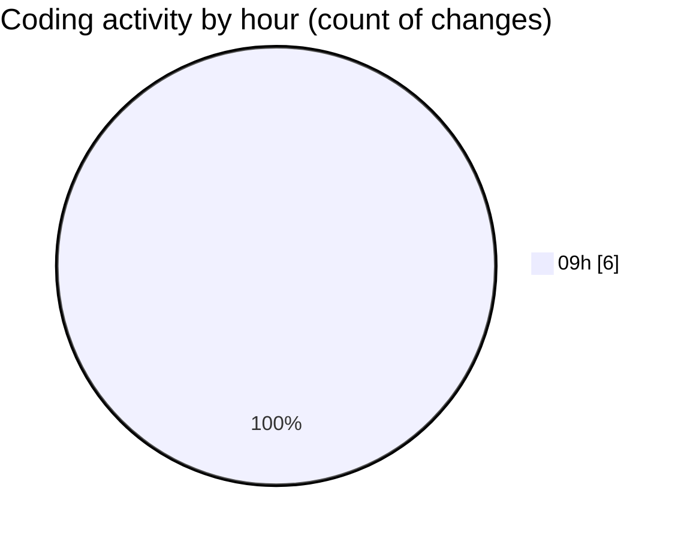

# cda - Activity Summary 

## Overall Statistics

| Stat                   | Value                                                             |
| ---------------------- | ----------------------------------------------------------------- |
| **Lines Added** (➕)   | 112                                          |
| **Lines Removed** (➖) | 242                                        |
| **Net Change** (↕)    | -130                |
| **Active Time** (⌚)   | 3 minutes |

## Modified Files
- **App.tsx** (+0, -21)
- **formatters.ts** (+0, -13)
- **Lds.tsx** (+0, -147)
- **Lds.test.tsx** (+0, -61)
- **.env** (+112, -0)

## Visualizations

### By File Type (Lines Changed)

### By Hour (Estimated Activity Count)

> **Last Updated:** 28/04/2026, 09:41:49