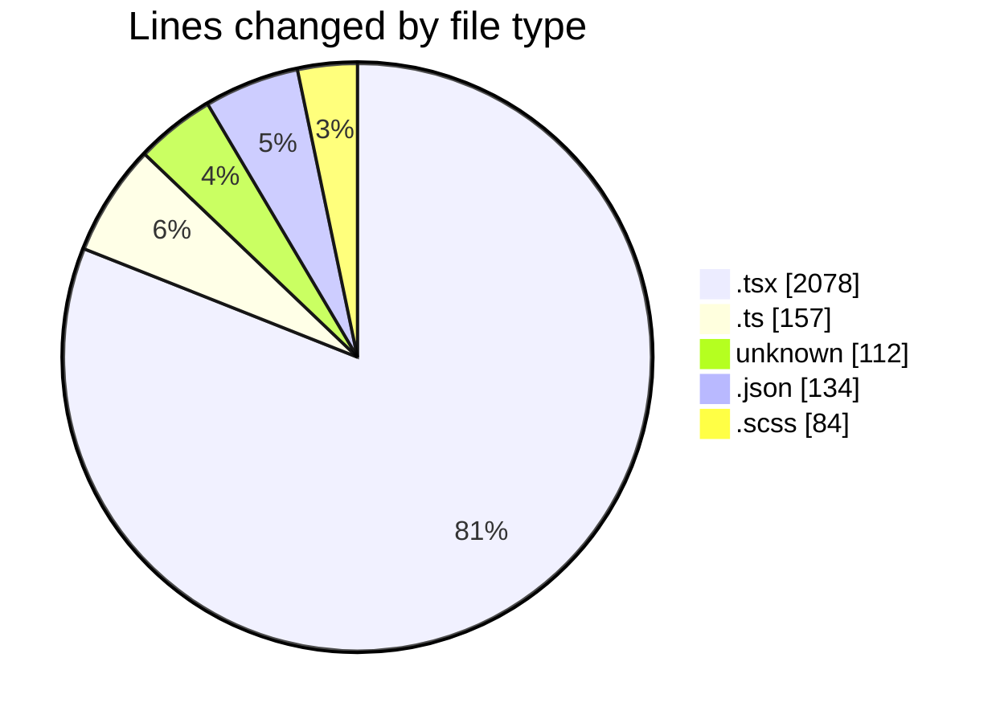
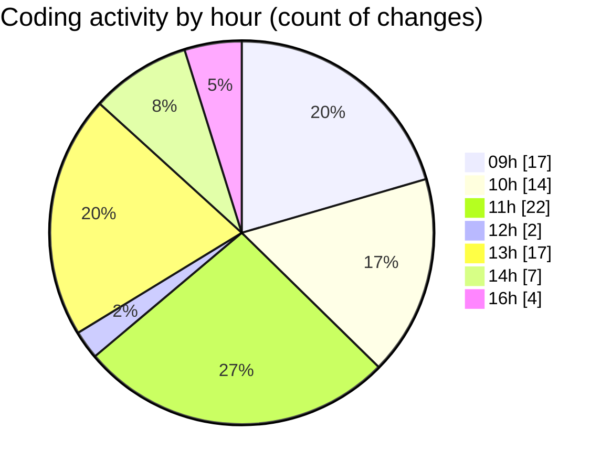

# cda - Activity Summary 

## Overall Statistics

| Stat                   | Value                                                             |
| ---------------------- | ----------------------------------------------------------------- |
| **Lines Added** (➕)   | 2137                                          |
| **Lines Removed** (➖) | 428                                        |
| **Net Change** (↕)    | 1709                |
| **Active Time** (⌚)   | 94 minutes |

## Modified Files
- **App.tsx** (+98, -31)
- **formatters.ts** (+13, -13)
- **Lds.tsx** (+147, -147)
- **Lds.test.tsx** (+61, -61)
- **.env** (+112, -0)
- **LdsSearch.tsx** (+2, -2)
- **package.json** (+134, -0)
- **ImportActions.test.tsx** (+248, -146)
- **CompareResults.tsx** (+133, -0)
- **CompareResults.scss** (+46, -0)
- **index.ts** (+4, -0)
- **Compare.tsx** (+180, -0)
- **Compare.scss** (+6, -0)
- **index.ts** (+4, -0)
- **Compare.test.tsx** (+176, -0)
- **ImportActions.tsx** (+136, -14)
- **getConnections.ts** (+71, -0)
- **getConnections.test.ts** (+48, -0)
- **AdminConnection.tsx** (+104, -6)
- **AdminConnection.scss** (+26, -0)
- **index.ts** (+2, -0)
- **Admin.tsx** (+106, -7)
- **Admin.scss** (+6, -0)
- **index.ts** (+2, -0)
- **Admin.test.tsx** (+102, -1)
- **Import.tsx** (+170, -0)

## Visualizations

### By File Type (Lines Changed)

### By Hour (Estimated Activity Count)

> **Last Updated:** 28/04/2026, 16:26:46