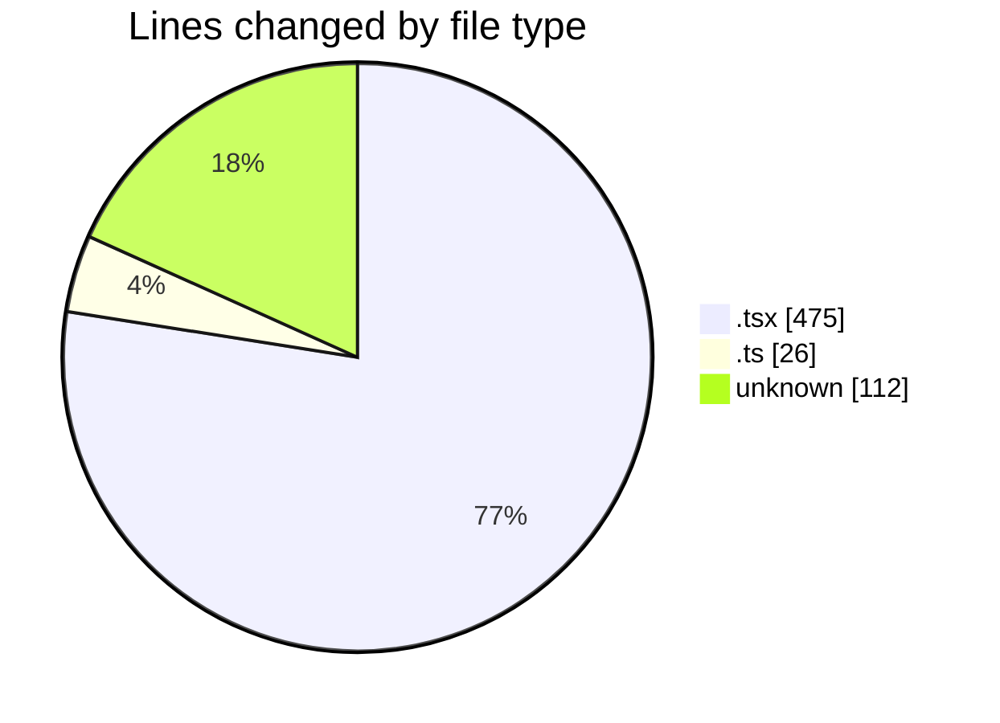
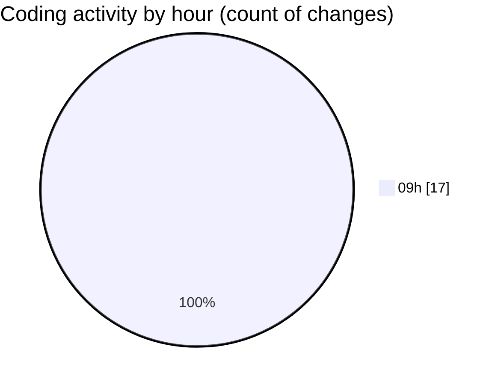

# cda - Activity Summary 

## Overall Statistics

| Stat                   | Value                                                             |
| ---------------------- | ----------------------------------------------------------------- |
| **Lines Added** (➕)   | 363                                          |
| **Lines Removed** (➖) | 250                                        |
| **Net Change** (↕)    | 113                |
| **Active Time** (⌚)   | 15 minutes |

## Modified Files
- **App.tsx** (+28, -29)
- **formatters.ts** (+13, -13)
- **Lds.tsx** (+147, -147)
- **Lds.test.tsx** (+61, -61)
- **.env** (+112, -0)
- **LdsSearch.tsx** (+2, -0)

## Visualizations

### By File Type (Lines Changed)

### By Hour (Estimated Activity Count)

> **Last Updated:** 28/04/2026, 09:56:49