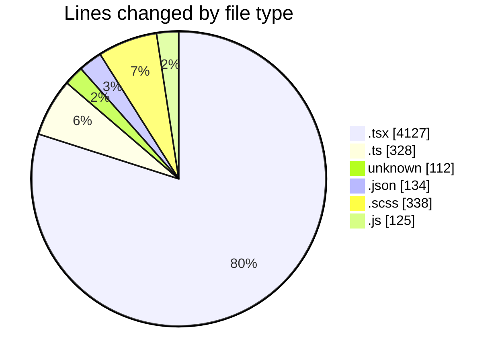
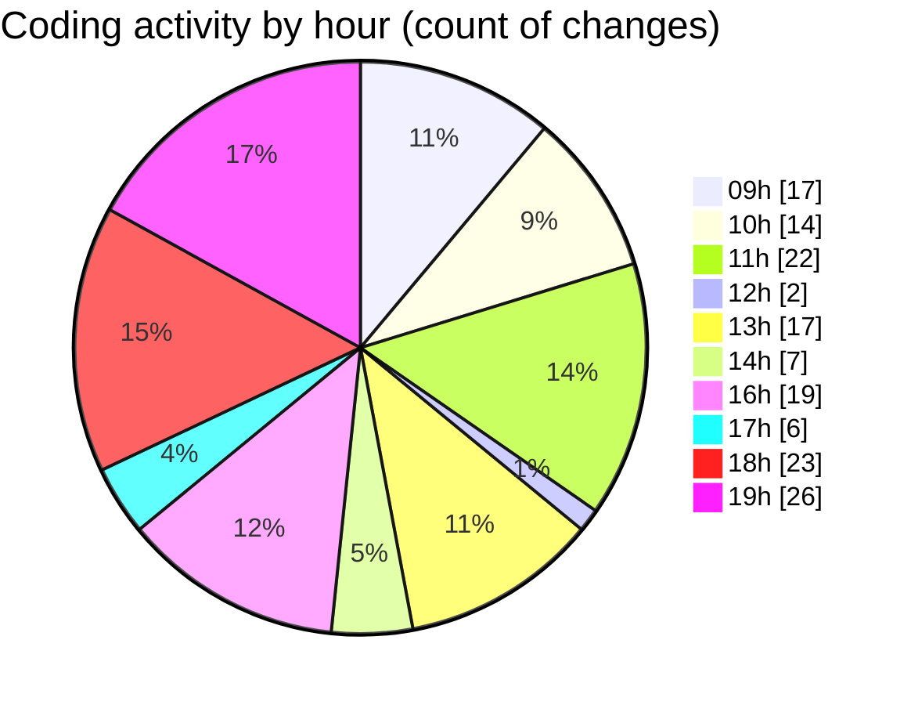

# cda - Activity Summary 

## Overall Statistics

| Stat                   | Value                                                             |
| ---------------------- | ----------------------------------------------------------------- |
| **Lines Added** (➕)   | 4601                                          |
| **Lines Removed** (➖) | 563                                        |
| **Net Change** (↕)    | 4038                |
| **Active Time** (⌚)   | 171 minutes |

## Modified Files
- **App.tsx** (+102, -35)
- **formatters.ts** (+13, -13)
- **Lds.tsx** (+309, -147)
- **Lds.test.tsx** (+135, -61)
- **.env** (+112, -0)
- **LdsSearch.tsx** (+91, -4)
- **package.json** (+134, -0)
- **ImportActions.test.tsx** (+248, -146)
- **CompareResults.tsx** (+286, -48)
- **CompareResults.scss** (+102, -4)
- **index.ts** (+4, -0)
- **Compare.tsx** (+219, -36)
- **Compare.scss** (+6, -0)
- **index.ts** (+4, -0)
- **Compare.test.tsx** (+176, -0)
- **ImportActions.tsx** (+136, -14)
- **getConnections.ts** (+85, -14)
- **getConnections.test.ts** (+75, -27)
- **AdminConnection.tsx** (+120, -6)
- **AdminConnection.scss** (+26, -0)
- **index.ts** (+2, -0)
- **Admin.tsx** (+109, -7)
- **Admin.scss** (+6, -0)
- **index.ts** (+2, -0)
- **Admin.test.tsx** (+102, -1)
- **Import.tsx** (+170, -0)
- **LdsSearch.test.tsx** (+144, -0)
- **SummaryReport.tsx** (+163, -0)
- **PsbSummary.tsx** (+136, -0)
- **PsbSummary.test.tsx** (+239, -0)
- **SummaryReport.test.tsx** (+136, -0)
- **LdsList.tsx** (+169, -0)
- **LdsList.scss** (+125, -0)
- **LdsList.test.tsx** (+257, -0)
- **SummaryReport.scss** (+24, -0)
- **ImportActions.scss** (+39, -0)
- **index.ts** (+4, -0)
- **Import.scss** (+6, -0)
- **index.ts** (+4, -0)
- **Import.test.tsx** (+74, -0)
- **ErrorBox.tsx** (+39, -0)
- **ErrorBox.test.tsx** (+62, -0)
- **mutations.ts** (+81, -0)
- **OfcomReportingEventRepository.js** (+125, -0)

## Visualizations

### By File Type (Lines Changed)

### By Hour (Estimated Activity Count)

> **Last Updated:** 28/04/2026, 19:21:46