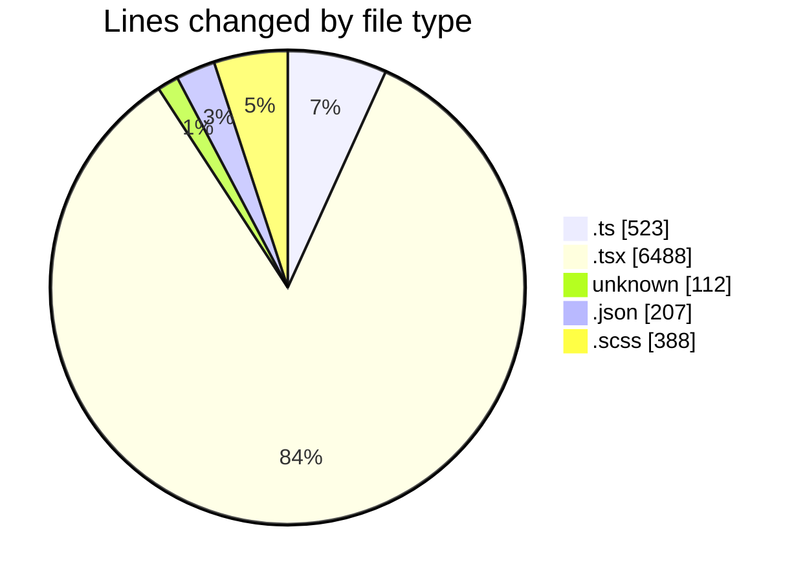
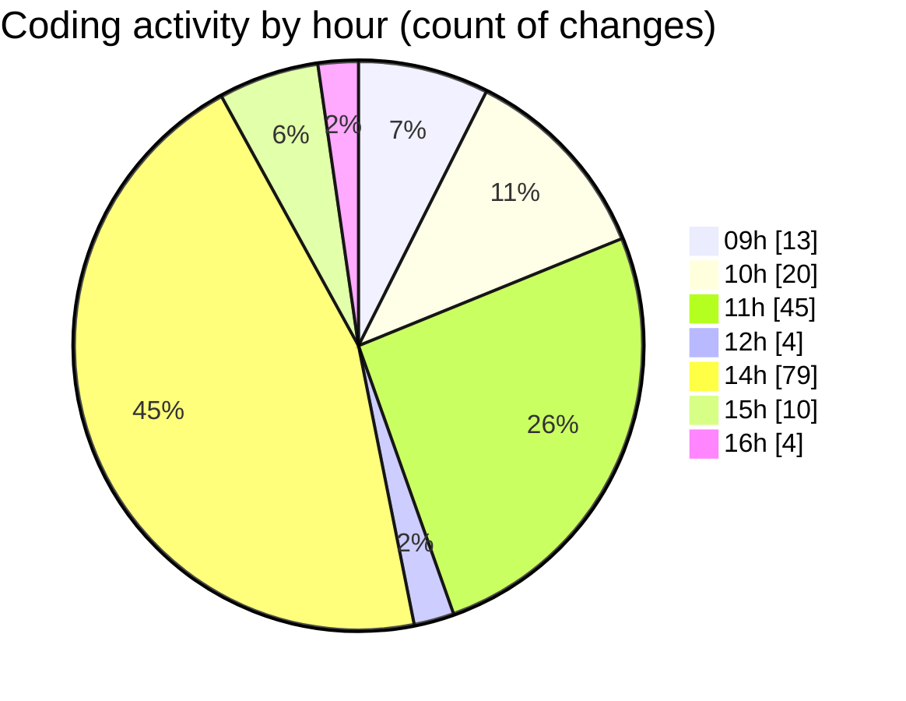

# cda - Activity Summary 

## Overall Statistics

| Stat                   | Value                                                             |
| ---------------------- | ----------------------------------------------------------------- |
| **Lines Added** (➕)   | 7469                                          |
| **Lines Removed** (➖) | 249                                        |
| **Net Change** (↕)    | 7220                |
| **Active Time** (⌚)   | 213 minutes |

## Modified Files
- **queries.ts** (+198, -11)
- **NoPermission.tsx** (+175, -25)
- **index.ts** (+12, -0)
- **App.tsx** (+254, -121)
- **App.test.tsx** (+125, -1)
- **.env** (+112, -0)
- **ConnectionsProvider.tsx** (+448, -35)
- **UserProvider.tsx** (+189, -0)
- **settings.json** (+192, -8)
- **connectionsContext.ts** (+87, -2)
- **getConnections.ts** (+114, -14)
- **getConnections.test.ts** (+42, -27)
- **PsbSummary.test.tsx** (+833, -0)
- **SummaryReport.tsx** (+326, -0)
- **PsbSummary.tsx** (+410, -0)
- **SummaryReport.test.tsx** (+272, -0)
- **LdsList.tsx** (+338, -0)
- **LdsSearch.test.tsx** (+288, -0)
- **LdsSearch.tsx** (+174, -0)
- **Lds.test.tsx** (+201, -1)
- **Lds.tsx** (+491, -2)
- **LdsList.scss** (+250, -0)
- **Import.scss** (+12, -0)
- **index.ts** (+8, -0)
- **Import.tsx** (+514, -2)
- **ImportActions.tsx** (+244, -0)
- **ImportActions.scss** (+78, -0)
- **SummaryReport.scss** (+48, -0)
- **LdsList.test.tsx** (+514, -0)
- **ImportActions.test.tsx** (+204, -0)
- **Import.test.tsx** (+200, -0)
- **index.ts** (+8, -0)
- **Admin.test.tsx** (+101, -0)
- **settings.json** (+7, -0)

## Visualizations

### By File Type (Lines Changed)

### By Hour (Estimated Activity Count)

> **Last Updated:** 29/04/2026, 16:55:42