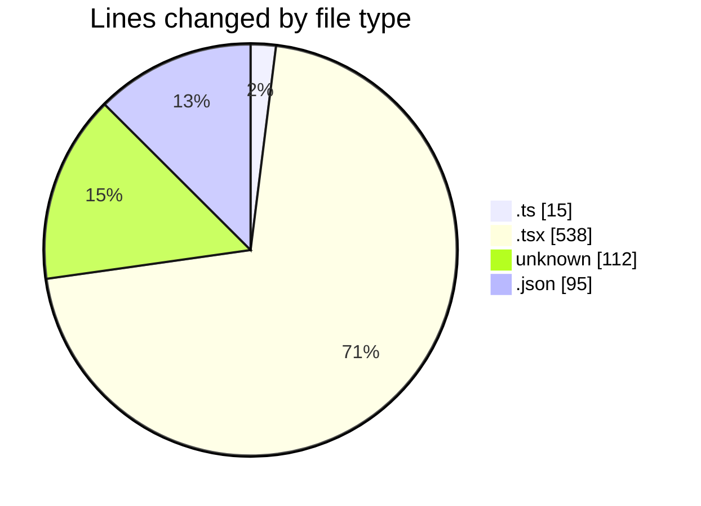
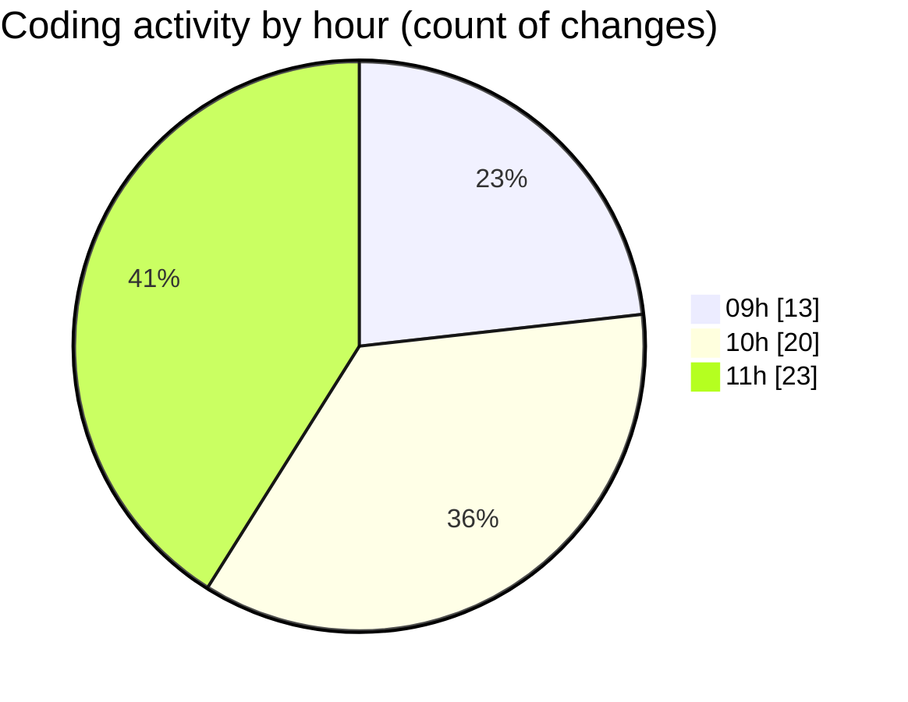

# cda - Activity Summary 

## Overall Statistics

| Stat                   | Value                                                             |
| ---------------------- | ----------------------------------------------------------------- |
| **Lines Added** (➕)   | 657                                          |
| **Lines Removed** (➖) | 103                                        |
| **Net Change** (↕)    | 554                |
| **Active Time** (⌚)   | 94 minutes |

## Modified Files
- **queries.ts** (+11, -0)
- **NoPermission.tsx** (+55, -25)
- **index.ts** (+4, -0)
- **App.tsx** (+83, -76)
- **App.test.tsx** (+125, -1)
- **.env** (+112, -0)
- **ConnectionsProvider.tsx** (+78, -1)
- **UserProvider.tsx** (+94, -0)
- **settings.json** (+95, -0)

## Visualizations

### By File Type (Lines Changed)

### By Hour (Estimated Activity Count)

> **Last Updated:** 29/04/2026, 11:17:40