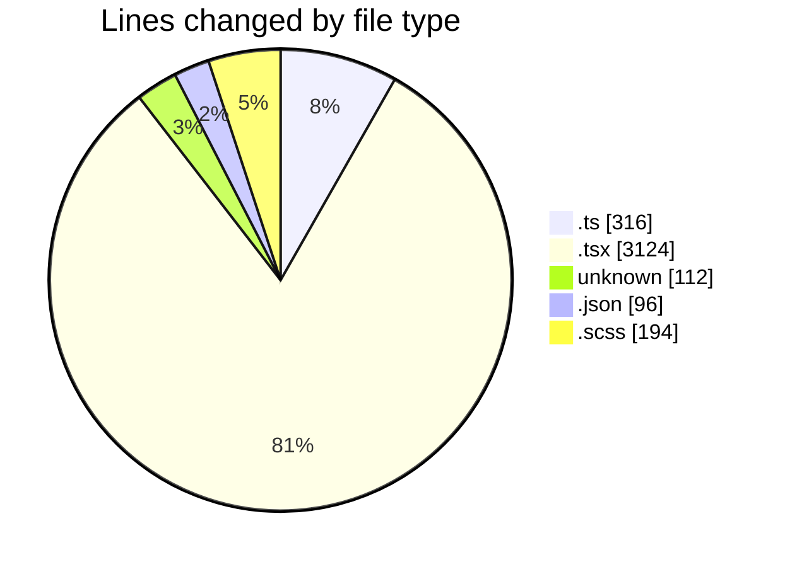
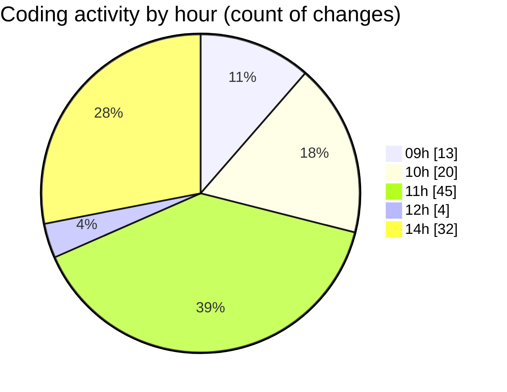

# cda - Activity Summary 

## Overall Statistics

| Stat                   | Value                                                             |
| ---------------------- | ----------------------------------------------------------------- |
| **Lines Added** (➕)   | 3639                                          |
| **Lines Removed** (➖) | 203                                        |
| **Net Change** (↕)    | 3436                |
| **Active Time** (⌚)   | 163 minutes |

## Modified Files
- **queries.ts** (+110, -11)
- **NoPermission.tsx** (+115, -25)
- **index.ts** (+8, -0)
- **App.tsx** (+190, -101)
- **App.test.tsx** (+125, -1)
- **.env** (+112, -0)
- **ConnectionsProvider.tsx** (+257, -22)
- **UserProvider.tsx** (+94, -0)
- **settings.json** (+96, -0)
- **connectionsContext.ts** (+58, -2)
- **getConnections.ts** (+57, -14)
- **getConnections.test.ts** (+21, -27)
- **PsbSummary.test.tsx** (+297, -0)
- **SummaryReport.tsx** (+163, -0)
- **PsbSummary.tsx** (+136, -0)
- **SummaryReport.test.tsx** (+136, -0)
- **LdsList.tsx** (+169, -0)
- **LdsSearch.test.tsx** (+144, -0)
- **LdsSearch.tsx** (+87, -0)
- **Lds.test.tsx** (+74, -0)
- **Lds.tsx** (+162, -0)
- **LdsList.scss** (+125, -0)
- **Import.scss** (+6, -0)
- **index.ts** (+4, -0)
- **Import.tsx** (+170, -0)
- **ImportActions.tsx** (+122, -0)
- **ImportActions.scss** (+39, -0)
- **SummaryReport.scss** (+24, -0)
- **LdsList.test.tsx** (+257, -0)
- **ImportActions.test.tsx** (+102, -0)
- **Import.test.tsx** (+74, -0)
- **index.ts** (+4, -0)
- **Admin.test.tsx** (+101, -0)

## Visualizations

### By File Type (Lines Changed)

### By Hour (Estimated Activity Count)

> **Last Updated:** 29/04/2026, 14:21:40