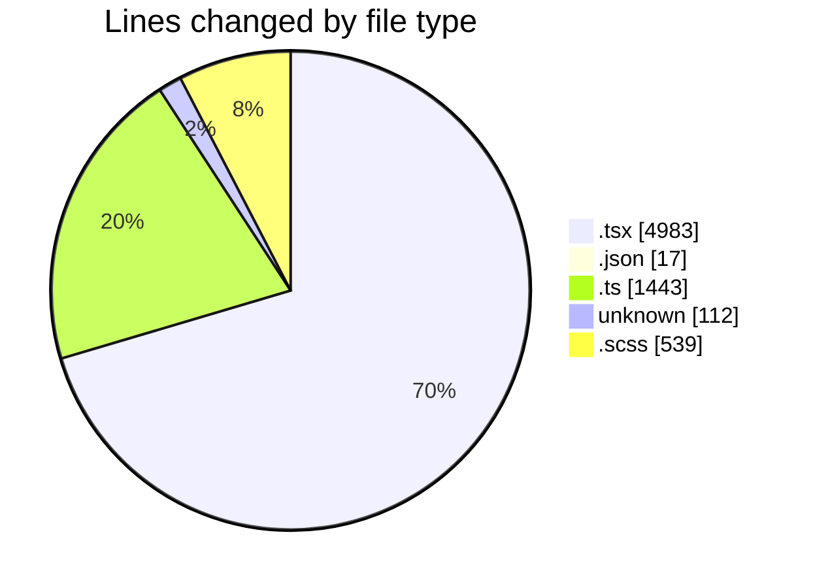
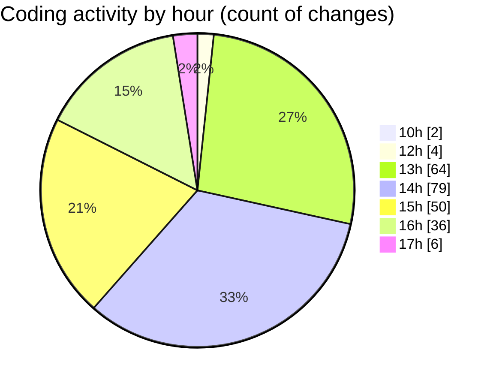

# cda - Activity Summary 

## Overall Statistics

| Stat                   | Value                                                             |
| ---------------------- | ----------------------------------------------------------------- |
| **Lines Added** (➕)   | 6014                                          |
| **Lines Removed** (➖) | 1080                                        |
| **Net Change** (↕)    | 4934                |
| **Active Time** (⌚)   | 275 minutes |

## Modified Files
- **PsbSummary.tsx** (+149, -8)
- **cspell.json** (+10, -0)
- **skill-mutations.ts** (+532, -0)
- **skill-admin-mutations.ts** (+283, -0)
- **.env** (+112, -0)
- **SummaryReport.tsx** (+182, -22)
- **PsbSummary.test.tsx** (+268, -0)
- **SummaryReport.test.tsx** (+138, -14)
- **Lds.test.tsx** (+100, -0)
- **Lds.tsx** (+165, -0)
- **LdsList.tsx** (+169, -0)
- **LdsSearch.test.tsx** (+144, -0)
- **LdsSearch.tsx** (+87, -0)
- **ImportActions.tsx** (+127, -10)
- **SummaryReport.scss** (+24, -0)
- **LdsList.test.tsx** (+257, -0)
- **LdsList.scss** (+125, -0)
- **App.tsx** (+66, -0)
- **ConnectionsProvider.tsx** (+86, -0)
- **index.ts** (+4, -0)
- **NoPermission.tsx** (+30, -0)
- **queries.ts** (+88, -0)
- **getConnections.test.ts** (+48, -0)
- **getConnections.ts** (+71, -0)
- **ImportActions.test.tsx** (+104, -0)
- **Import.test.tsx** (+100, -0)
- **index.ts** (+4, -0)
- **Import.scss** (+6, -0)
- **Import.tsx** (+176, -1)
- **index.ts** (+4, -0)
- **ImportActions.scss** (+39, -0)
- **connectionsContext.ts** (+29, -0)
- **Compare.tsx** (+254, -99)
- **Admin.tsx** (+99, -2)
- **settings.json** (+7, -0)
- **csvHelpers.ts** (+65, -35)
- **Compare.test.tsx** (+204, -0)
- **config.ts** (+44, -18)
- **CompareResults.tsx** (+347, -193)
- **testDataLoader.ts** (+154, -54)
- **CompareList.tsx** (+183, -139)
- **CompareList.scss** (+62, -45)
- **CompareResults.scss** (+118, -65)
- **index.ts** (+4, -1)
- **CompareList.test.tsx** (+212, -143)
- **CompareModal.tsx** (+86, -3)
- **index.ts** (+4, -1)
- **CompareModal.scss** (+55, -0)
- **CompareModal.test.tsx** (+128, -75)
- **CompareResults.test.tsx** (+261, -152)

## Visualizations

### By File Type (Lines Changed)

### By Hour (Estimated Activity Count)

> **Last Updated:** 30/04/2026, 17:20:59