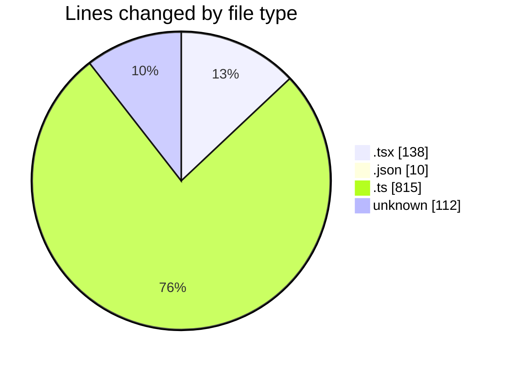
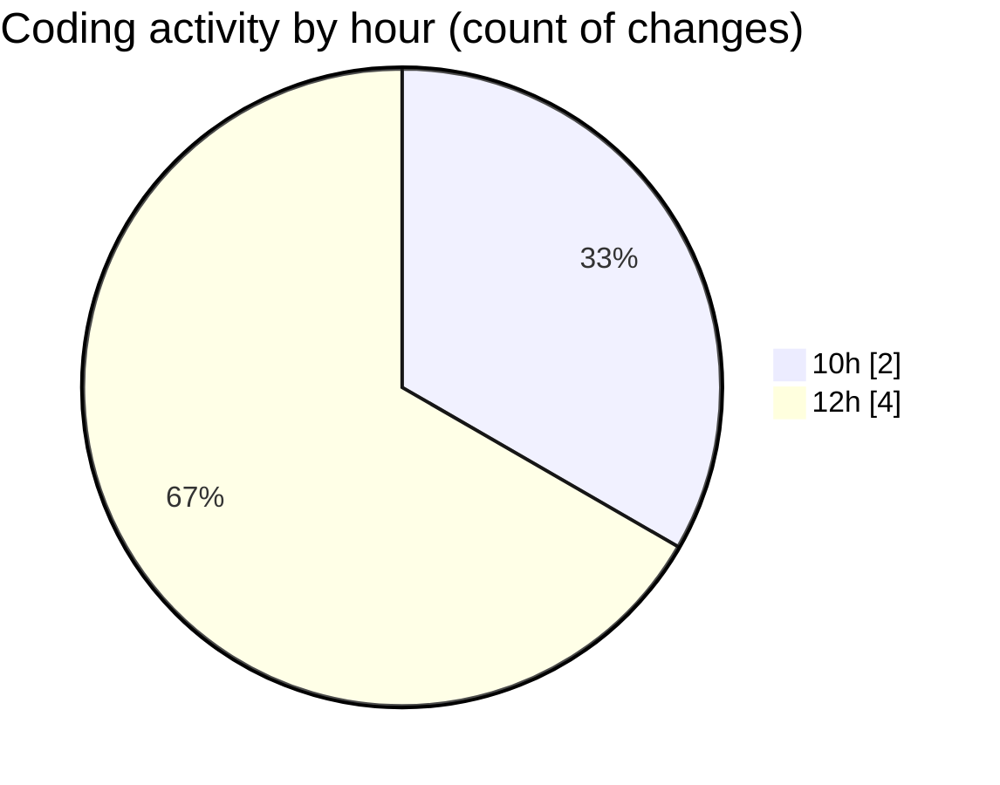

# cda - Activity Summary 

## Overall Statistics

| Stat                   | Value                                                             |
| ---------------------- | ----------------------------------------------------------------- |
| **Lines Added** (➕)   | 1075                                          |
| **Lines Removed** (➖) | 0                                        |
| **Net Change** (↕)    | 1075                |
| **Active Time** (⌚)   | 1 minute |

## Modified Files
- **PsbSummary.tsx** (+138, -0)
- **cspell.json** (+10, -0)
- **skill-mutations.ts** (+532, -0)
- **skill-admin-mutations.ts** (+283, -0)
- **.env** (+112, -0)

## Visualizations

### By File Type (Lines Changed)

### By Hour (Estimated Activity Count)

> **Last Updated:** 30/04/2026, 12:30:59