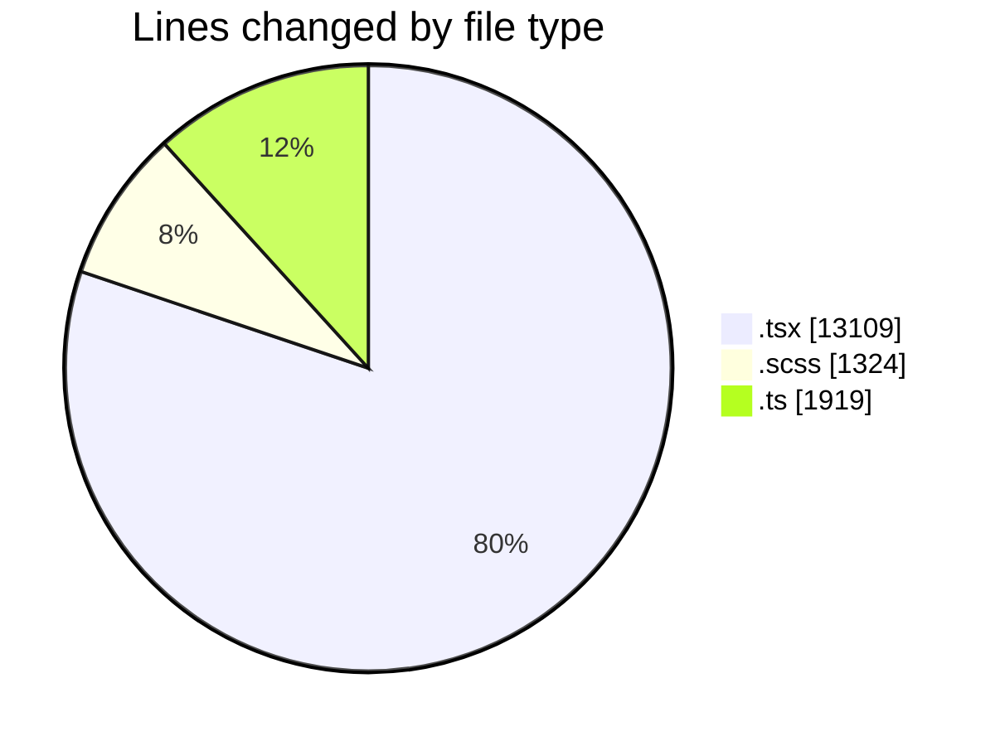
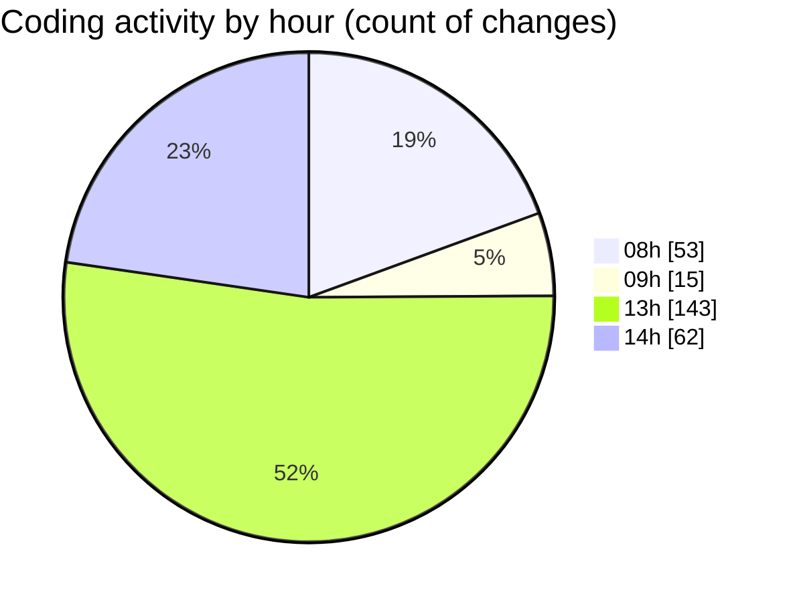

# cda - Activity Summary 

## Overall Statistics

| Stat                   | Value                                                             |
| ---------------------- | ----------------------------------------------------------------- |
| **Lines Added** (➕)   | 16159                                          |
| **Lines Removed** (➖) | 193                                        |
| **Net Change** (↕)    | 15966                |
| **Active Time** (⌚)   | 318 minutes |

## Modified Files
- **ImportActions.test.tsx** (+413, -1)
- **PsbSummary.tsx** (+562, -2)
- **SummaryReport.tsx** (+640, -0)
- **PsbSummary.test.tsx** (+1072, -0)
- **SummaryReport.test.tsx** (+496, -0)
- **LdsSearch.tsx** (+348, -0)
- **Lds.test.tsx** (+400, -0)
- **Lds.tsx** (+660, -0)
- **App.tsx** (+264, -0)
- **LdsList.scss** (+500, -0)
- **LdsList.tsx** (+676, -0)
- **LdsSearch.test.tsx** (+576, -0)
- **Import.test.tsx** (+400, -0)
- **index.ts** (+16, -0)
- **Import.scss** (+24, -0)
- **Import.tsx** (+698, -2)
- **index.ts** (+16, -0)
- **ImportActions.scss** (+156, -0)
- **ImportActions.tsx** (+468, -0)
- **SummaryReport.scss** (+96, -0)
- **LdsList.test.tsx** (+1028, -0)
- **CompareModal.test.tsx** (+212, -0)
- **CompareList.test.tsx** (+282, -0)
- **CompareModal.scss** (+220, -0)
- **index.ts** (+12, -0)
- **CompareModal.tsx** (+377, -7)
- **CompareList.scss** (+72, -56)
- **CompareList.tsx** (+200, -23)
- **CompareResults.scss** (+200, -0)
- **CompareResults.tsx** (+590, -35)
- **testDataLoader.ts** (+673, -0)
- **Compare.test.tsx** (+816, -0)
- **config.ts** (+26, -0)
- **Compare.tsx** (+678, -61)
- **csvHelpers.ts** (+116, -4)
- **connectionsContext.ts** (+120, -0)
- **ConnectionsProvider.tsx** (+372, -0)
- **index.ts** (+16, -0)
- **queries.ts** (+352, -0)
- **NoPermission.tsx** (+120, -0)
- **getConnections.test.ts** (+192, -0)
- **getConnections.ts** (+284, -0)
- **CompareResults.test.tsx** (+436, -0)
- **config.ts** (+52, -0)
- **Admin.tsx** (+192, -2)
- **formatters.ts** (+40, -0)

## Visualizations

### By File Type (Lines Changed)

### By Hour (Estimated Activity Count)

> **Last Updated:** 01/05/2026, 14:38:55