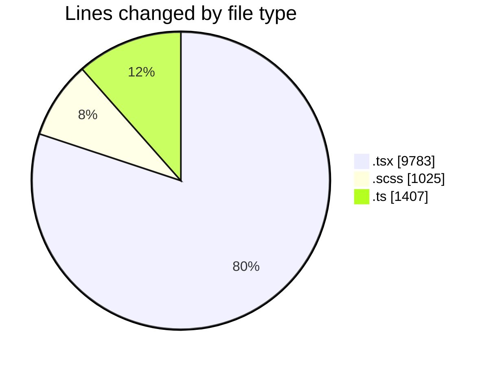
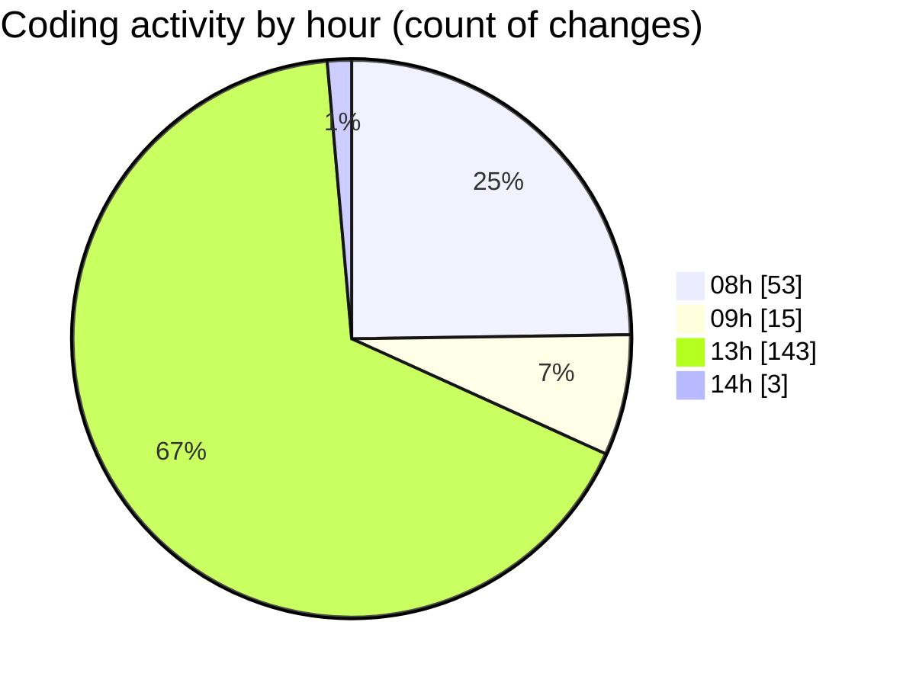

# cda - Activity Summary 

## Overall Statistics

| Stat                   | Value                                                             |
| ---------------------- | ----------------------------------------------------------------- |
| **Lines Added** (➕)   | 12052                                          |
| **Lines Removed** (➖) | 163                                        |
| **Net Change** (↕)    | 11889                |
| **Active Time** (⌚)   | 254 minutes |

## Modified Files
- **ImportActions.test.tsx** (+310, -1)
- **PsbSummary.tsx** (+423, -2)
- **SummaryReport.tsx** (+480, -0)
- **PsbSummary.test.tsx** (+804, -0)
- **SummaryReport.test.tsx** (+372, -0)
- **LdsSearch.tsx** (+261, -0)
- **Lds.test.tsx** (+300, -0)
- **Lds.tsx** (+495, -0)
- **App.tsx** (+198, -0)
- **LdsList.scss** (+375, -0)
- **LdsList.tsx** (+507, -0)
- **LdsSearch.test.tsx** (+432, -0)
- **Import.test.tsx** (+300, -0)
- **index.ts** (+12, -0)
- **Import.scss** (+18, -0)
- **Import.tsx** (+525, -2)
- **index.ts** (+12, -0)
- **ImportActions.scss** (+117, -0)
- **ImportActions.tsx** (+351, -0)
- **SummaryReport.scss** (+72, -0)
- **LdsList.test.tsx** (+771, -0)
- **CompareModal.test.tsx** (+159, -0)
- **CompareList.test.tsx** (+211, -0)
- **CompareModal.scss** (+165, -0)
- **index.ts** (+9, -0)
- **CompareModal.tsx** (+280, -7)
- **CompareList.scss** (+72, -56)
- **CompareList.tsx** (+138, -8)
- **CompareResults.scss** (+150, -0)
- **CompareResults.tsx** (+452, -26)
- **testDataLoader.ts** (+482, -0)
- **Compare.test.tsx** (+612, -0)
- **config.ts** (+26, -0)
- **Compare.tsx** (+513, -55)
- **csvHelpers.ts** (+88, -4)
- **connectionsContext.ts** (+89, -0)
- **ConnectionsProvider.tsx** (+272, -0)
- **index.ts** (+12, -0)
- **queries.ts** (+264, -0)
- **NoPermission.tsx** (+90, -0)
- **getConnections.test.ts** (+144, -0)
- **getConnections.ts** (+213, -0)
- **CompareResults.test.tsx** (+327, -0)
- **config.ts** (+52, -0)
- **Admin.tsx** (+97, -2)

## Visualizations

### By File Type (Lines Changed)

### By Hour (Estimated Activity Count)

> **Last Updated:** 01/05/2026, 14:03:01