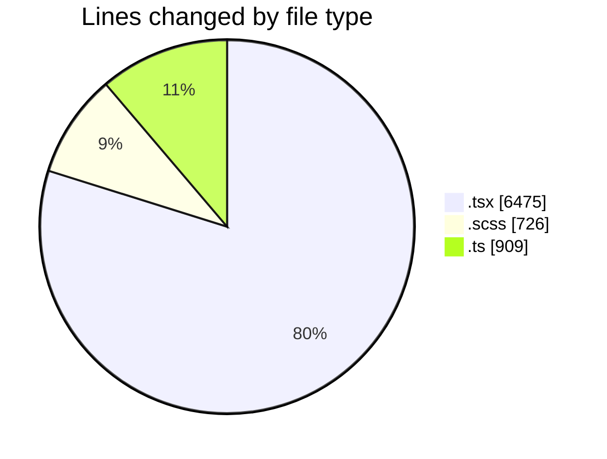
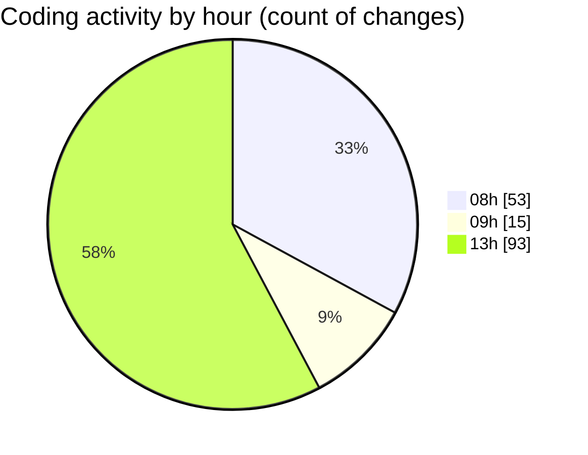

# cda - Activity Summary 

## Overall Statistics

| Stat                   | Value                                                             |
| ---------------------- | ----------------------------------------------------------------- |
| **Lines Added** (➕)   | 7970                                          |
| **Lines Removed** (➖) | 140                                        |
| **Net Change** (↕)    | 7830                |
| **Active Time** (⌚)   | 202 minutes |

## Modified Files
- **ImportActions.test.tsx** (+207, -1)
- **PsbSummary.tsx** (+282, -0)
- **SummaryReport.tsx** (+320, -0)
- **PsbSummary.test.tsx** (+536, -0)
- **SummaryReport.test.tsx** (+248, -0)
- **LdsSearch.tsx** (+174, -0)
- **Lds.test.tsx** (+200, -0)
- **Lds.tsx** (+330, -0)
- **App.tsx** (+132, -0)
- **LdsList.scss** (+250, -0)
- **LdsList.tsx** (+338, -0)
- **LdsSearch.test.tsx** (+288, -0)
- **Import.test.tsx** (+200, -0)
- **index.ts** (+8, -0)
- **Import.scss** (+12, -0)
- **Import.tsx** (+350, -0)
- **index.ts** (+8, -0)
- **ImportActions.scss** (+78, -0)
- **ImportActions.tsx** (+234, -0)
- **SummaryReport.scss** (+48, -0)
- **LdsList.test.tsx** (+514, -0)
- **CompareModal.test.tsx** (+106, -0)
- **CompareList.test.tsx** (+140, -0)
- **CompareModal.scss** (+110, -0)
- **index.ts** (+6, -0)
- **CompareModal.tsx** (+185, -7)
- **CompareList.scss** (+72, -56)
- **CompareList.tsx** (+95, -8)
- **CompareResults.scss** (+100, -0)
- **CompareResults.tsx** (+302, -14)
- **testDataLoader.ts** (+291, -0)
- **Compare.test.tsx** (+408, -0)
- **config.ts** (+26, -0)
- **Compare.tsx** (+356, -50)
- **csvHelpers.ts** (+60, -4)
- **connectionsContext.ts** (+58, -0)
- **ConnectionsProvider.tsx** (+172, -0)
- **index.ts** (+8, -0)
- **queries.ts** (+176, -0)
- **NoPermission.tsx** (+60, -0)
- **getConnections.test.ts** (+96, -0)
- **getConnections.ts** (+142, -0)
- **CompareResults.test.tsx** (+218, -0)
- **config.ts** (+26, -0)

## Visualizations

### By File Type (Lines Changed)

### By Hour (Estimated Activity Count)

> **Last Updated:** 01/05/2026, 13:51:03