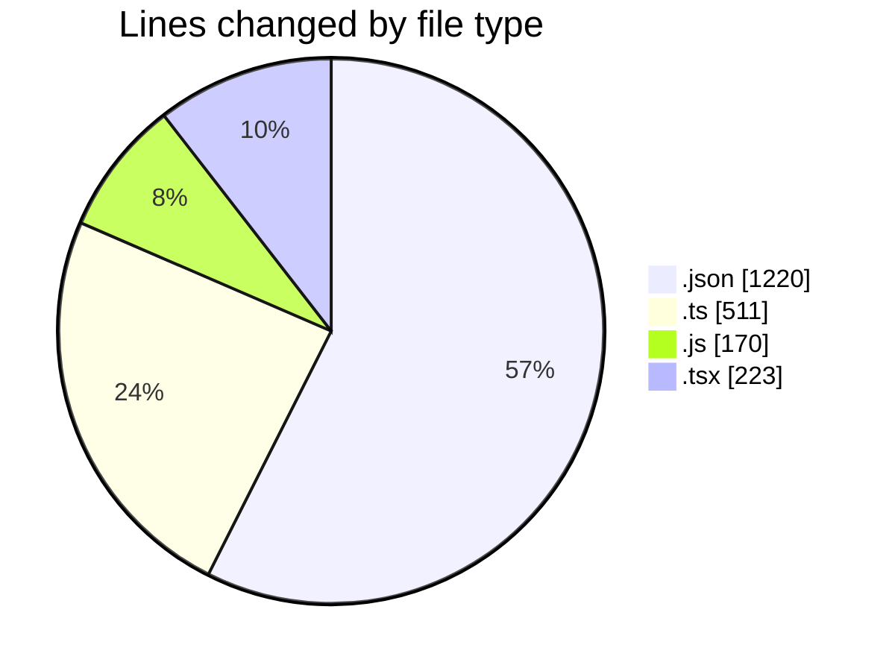
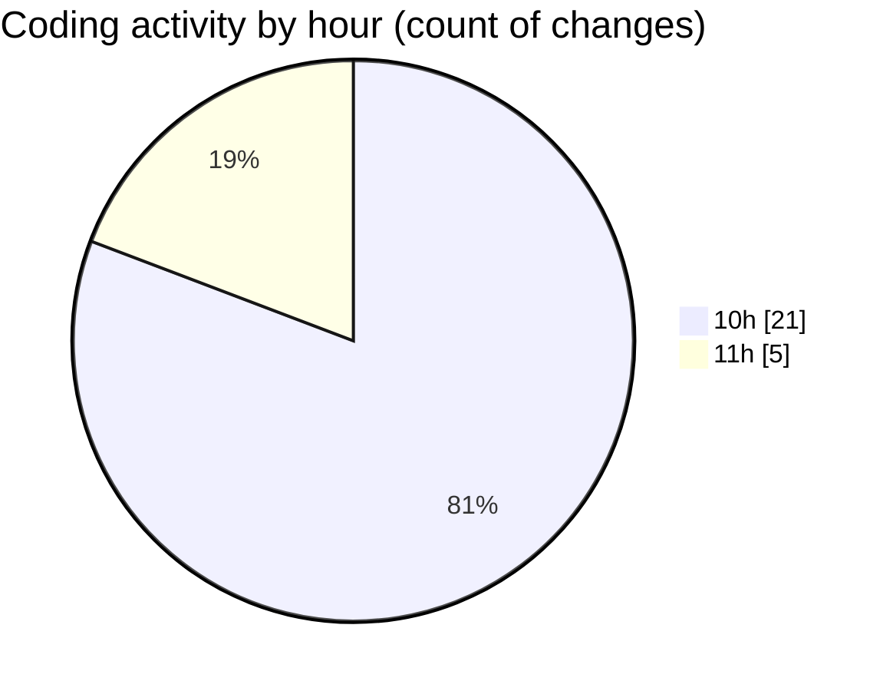

# cda - Activity Summary 

## Overall Statistics

| Stat                   | Value                                                             |
| ---------------------- | ----------------------------------------------------------------- |
| **Lines Added** (➕)   | 2121                                          |
| **Lines Removed** (➖) | 3                                        |
| **Net Change** (↕)    | 2118                |
| **Active Time** (⌚)   | 33 minutes |

## Modified Files
- **package.json** (+80, -0)
- **package.json** (+79, -0)
- **package.json** (+63, -0)
- **package.json** (+36, -0)
- **package.json** (+68, -0)
- **package.json** (+55, -0)
- **package.json** (+51, -0)
- **package.json** (+77, -0)
- **package.json** (+62, -0)
- **package.json** (+55, -0)
- **package.json** (+66, -0)
- **package.json** (+67, -0)
- **package.json** (+61, -0)
- **package.json** (+54, -0)
- **package.json** (+68, -0)
- **package.json** (+75, -0)
- **package.json** (+82, -0)
- **package.json** (+52, -0)
- **package.json** (+69, -0)
- **index.ts** (+511, -0)
- **index.js** (+170, -0)
- **App.tsx** (+220, -3)

## Visualizations

### By File Type (Lines Changed)

### By Hour (Estimated Activity Count)

> **Last Updated:** 05/05/2026, 11:09:06