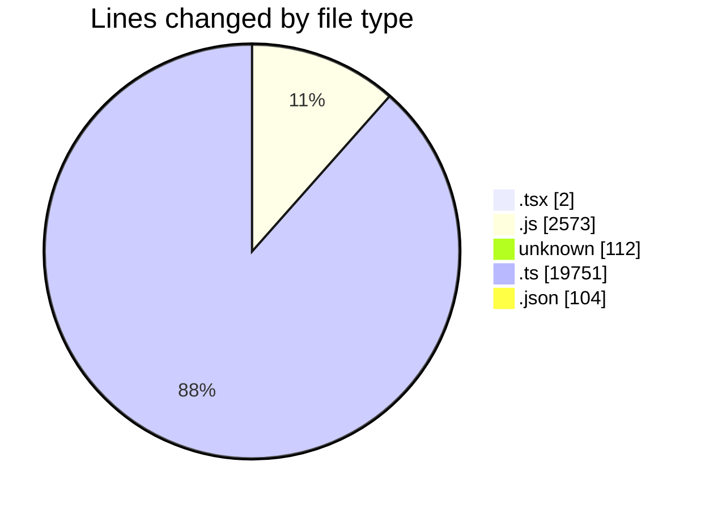
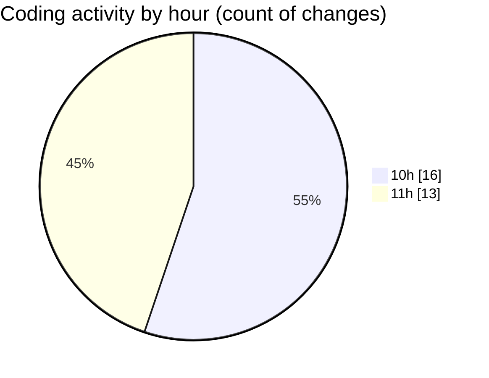

# cda - Activity Summary 

## Overall Statistics

| Stat                   | Value                                                             |
| ---------------------- | ----------------------------------------------------------------- |
| **Lines Added** (➕)   | 22538                                          |
| **Lines Removed** (➖) | 4                                        |
| **Net Change** (↕)    | 22534                |
| **Active Time** (⌚)   | 41 minutes |

## Modified Files
- **App.tsx** (+2, -0)
- **20260413103903-add-manager-id-to-person-data-table.js** (+13, -0)
- **20260416145412-replace-poepleview-profile-view.js** (+143, -1)
- **20260506091623-replce-peopleview-profilep-view.js** (+286, -0)
- **.env** (+112, -0)
- **vulcan.ts** (+1926, -0)
- **sap_tables.ts** (+997, -0)
- **sap_views.ts** (+1718, -0)
- **settings.json** (+16, -0)
- **profile.js** (+243, -0)
- **peopleview.js** (+448, -0)
- **profile.test.js** (+875, -3)
- **PeopleViewRepository.js** (+195, -0)
- **settings.json** (+88, -0)
- **Person.js** (+366, -0)
- **resolvers-types.ts** (+15110, -0)

## Visualizations

### By File Type (Lines Changed)

### By Hour (Estimated Activity Count)

> **Last Updated:** 06/05/2026, 11:38:24