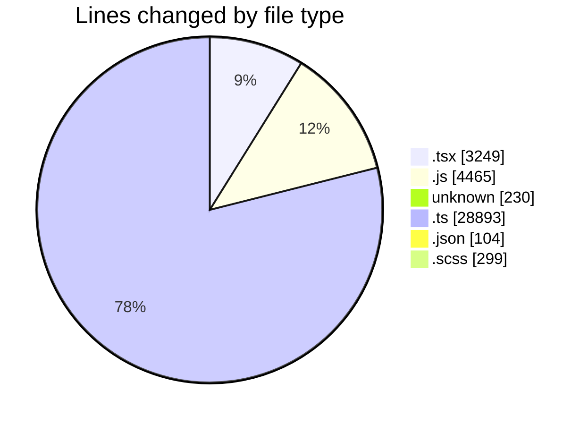
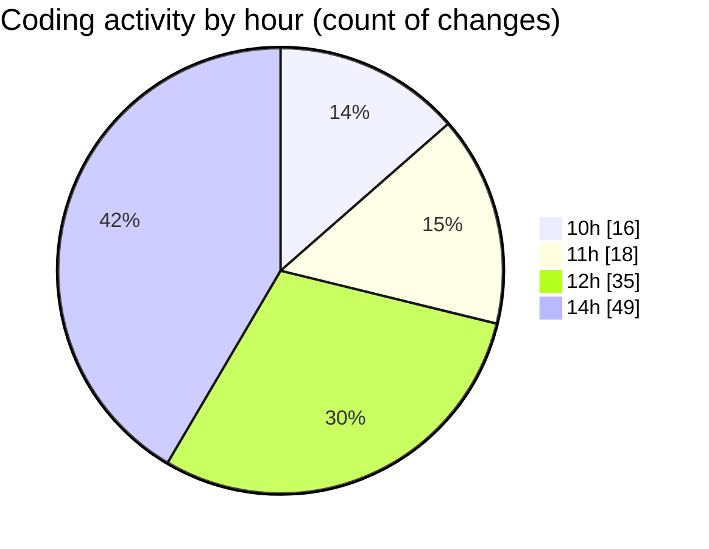

# cda - Activity Summary 

## Overall Statistics

| Stat                   | Value                                                             |
| ---------------------- | ----------------------------------------------------------------- |
| **Lines Added** (➕)   | 37189                                          |
| **Lines Removed** (➖) | 51                                        |
| **Net Change** (↕)    | 37138                |
| **Active Time** (⌚)   | 171 minutes |

## Modified Files
- **App.tsx** (+2, -0)
- **20260413103903-add-manager-id-to-person-data-table.js** (+13, -0)
- **20260416145412-replace-poepleview-profile-view.js** (+143, -1)
- **20260506091623-replce-peopleview-profilep-view.js** (+291, -1)
- **.env** (+230, -0)
- **vulcan.ts** (+3181, -0)
- **sap_tables.ts** (+1899, -0)
- **sap_views.ts** (+3444, -0)
- **settings.json** (+16, -0)
- **profile.js** (+264, -0)
- **peopleview.js** (+456, -1)
- **profile.test.js** (+886, -7)
- **PeopleViewRepository.js** (+195, -0)
- **settings.json** (+88, -0)
- **Person.js** (+366, -1)
- **resolvers-types.ts** (+15127, -0)
- **clear_view_views.ts** (+4151, -0)
- **peopleview-queries.js** (+869, -40)
- **PsbSummary.tsx** (+139, -0)
- **SummaryReport.tsx** (+160, -0)
- **Lds.test.tsx** (+100, -0)
- **Lds.tsx** (+165, -0)
- **SummaryReport.test.tsx** (+124, -0)
- **PsbSummary.test.tsx** (+268, -0)
- **Import.tsx** (+173, -0)
- **index.ts** (+4, -0)
- **ImportActions.scss** (+39, -0)
- **ImportActions.tsx** (+117, -0)
- **LdsList.test.tsx** (+257, -0)
- **LdsList.scss** (+125, -0)
- **SummaryReport.scss** (+24, -0)
- **App.tsx** (+66, -0)
- **LdsList.tsx** (+169, -0)
- **LdsSearch.test.tsx** (+144, -0)
- **LdsSearch.tsx** (+87, -0)
- **CompareResults.test.tsx** (+109, -0)
- **CompareModal.test.tsx** (+53, -0)
- **CompareList.test.tsx** (+71, -0)
- **CompareModal.scss** (+55, -0)
- **index.ts** (+3, -0)
- **CompareModal.tsx** (+96, -0)
- **CompareList.tsx** (+45, -0)
- **CompareResults.scss** (+50, -0)
- **CompareResults.tsx** (+129, -0)
- **Compare.tsx** (+143, -0)
- **Compare.test.tsx** (+204, -0)
- **csvHelpers.ts** (+28, -0)
- **ConnectionsProvider.tsx** (+100, -0)
- **index.ts** (+4, -0)
- **NoPermission.tsx** (+30, -0)
- **connectionsContext.ts** (+31, -0)
- **getConnections.ts** (+71, -0)
- **getConnections.test.ts** (+48, -0)
- **ImportActions.test.tsx** (+103, -0)
- **Import.test.tsx** (+100, -0)
- **queries.ts** (+88, -0)
- **index.ts** (+4, -0)
- **Import.scss** (+6, -0)
- **Admin.tsx** (+95, -0)
- **queries.ts** (+810, -0)
- **peopleview-mutations.js** (+931, -0)

## Visualizations

### By File Type (Lines Changed)

### By Hour (Estimated Activity Count)

> **Last Updated:** 06/05/2026, 14:46:20