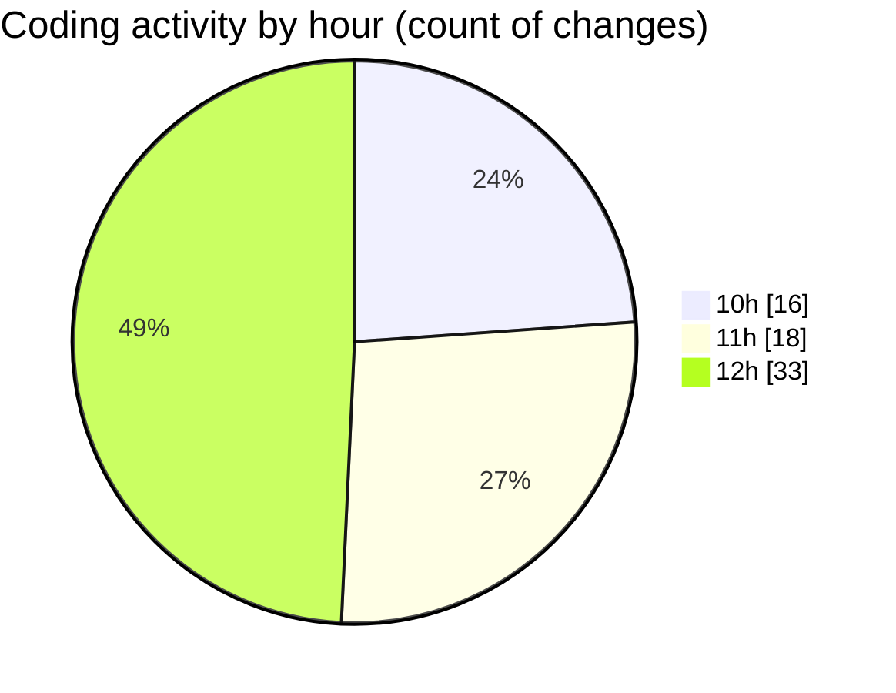

# cda - Activity Summary 

## Overall Statistics

| Stat                   | Value                                                             |
| ---------------------- | ----------------------------------------------------------------- |
| **Lines Added** (➕)   | 31611                                          |
| **Lines Removed** (➖) | 48                                        |
| **Net Change** (↕)    | 31563                |
| **Active Time** (⌚)   | 114 minutes |

## Modified Files
- **App.tsx** (+2, -0)
- **20260413103903-add-manager-id-to-person-data-table.js** (+13, -0)
- **20260416145412-replace-poepleview-profile-view.js** (+143, -1)
- **20260506091623-replce-peopleview-profilep-view.js** (+291, -1)
- **.env** (+230, -0)
- **vulcan.ts** (+3181, -0)
- **sap_tables.ts** (+1899, -0)
- **sap_views.ts** (+3444, -0)
- **settings.json** (+16, -0)
- **profile.js** (+264, -0)
- **peopleview.js** (+456, -1)
- **profile.test.js** (+886, -7)
- **PeopleViewRepository.js** (+195, -0)
- **settings.json** (+88, -0)
- **Person.js** (+366, -1)
- **resolvers-types.ts** (+15127, -0)
- **clear_view_views.ts** (+4151, -0)
- **peopleview-queries.js** (+859, -37)

## Visualizations

### By File Type (Lines Changed)

### By Hour (Estimated Activity Count)

> **Last Updated:** 06/05/2026, 12:53:25