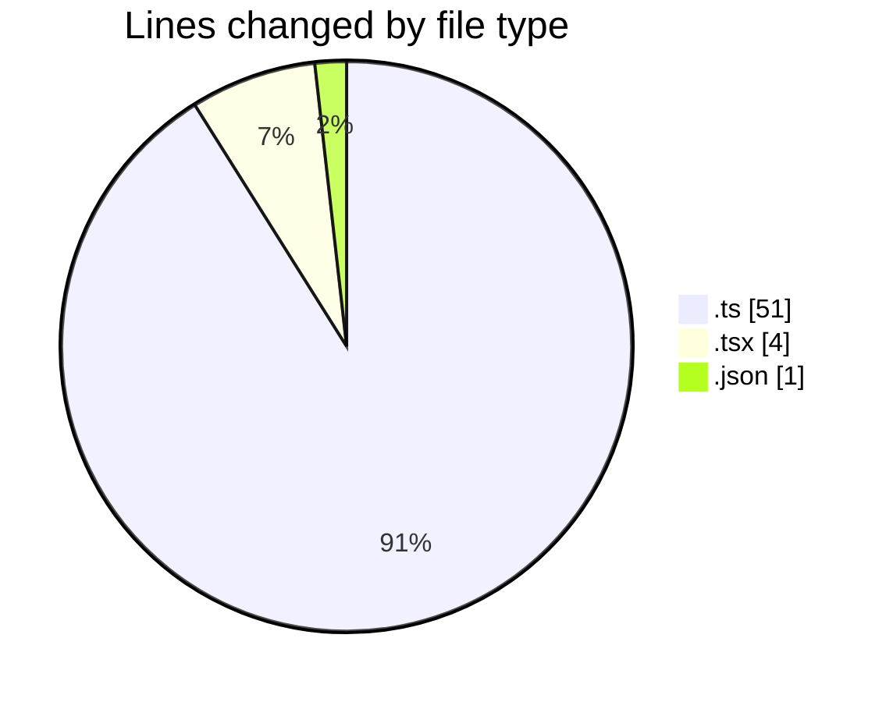
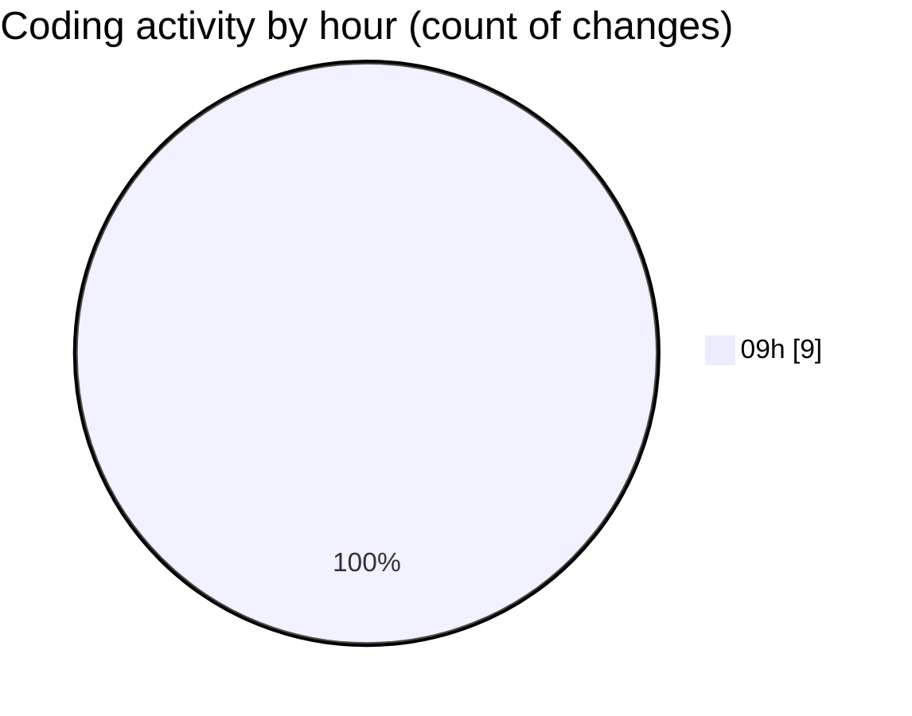

# cda - Activity Summary 

## Overall Statistics

| Stat                   | Value                                                             |
| ---------------------- | ----------------------------------------------------------------- |
| **Lines Added** (➕)   | 31                                          |
| **Lines Removed** (➖) | 25                                        |
| **Net Change** (↕)    | 6                |
| **Active Time** (⌚)   | 9 minutes |

## Modified Files
- **fieldUtils.ts** (+28, -23)
- **ConstructFieldContent.tsx** (+1, -1)
- **ConstructDefinitionListItem.tsx** (+1, -1)
- **settings.json** (+1, -0)

## Visualizations

### By File Type (Lines Changed)

### By Hour (Estimated Activity Count)

> **Last Updated:** 07/05/2026, 09:19:28