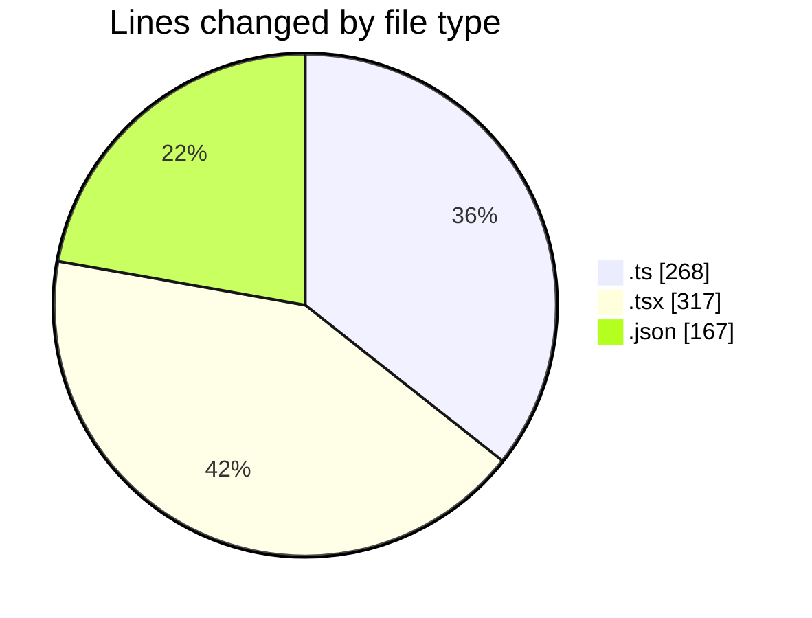
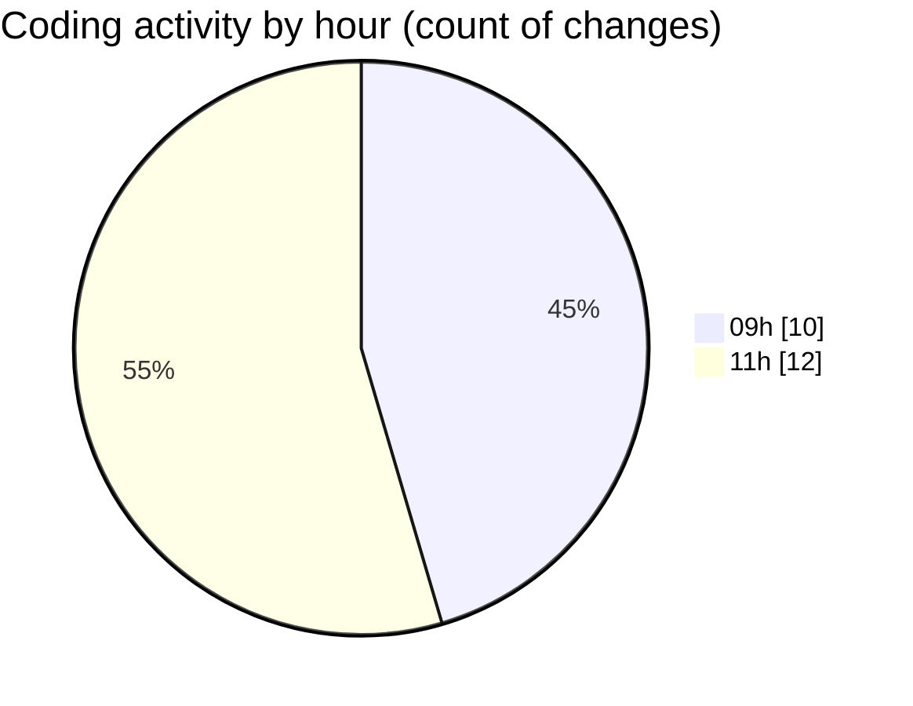

# cda - Activity Summary 

## Overall Statistics

| Stat                   | Value                                                             |
| ---------------------- | ----------------------------------------------------------------- |
| **Lines Added** (➕)   | 720                                          |
| **Lines Removed** (➖) | 32                                        |
| **Net Change** (↕)    | 688                |
| **Active Time** (⌚)   | 23 minutes |

## Modified Files
- **fieldUtils.ts** (+233, -23)
- **ConstructFieldContent.tsx** (+1, -1)
- **ConstructDefinitionListItem.tsx** (+1, -1)
- **settings.json** (+1, -0)
- **package.json** (+68, -0)
- **ProfilePublic.tsx** (+200, -0)
- **package.json** (+33, -0)
- **DescriptionList.tsx** (+111, -2)
- **global.d.ts** (+7, -5)
- **package.json** (+65, -0)

## Visualizations

### By File Type (Lines Changed)

### By Hour (Estimated Activity Count)

> **Last Updated:** 07/05/2026, 11:43:15