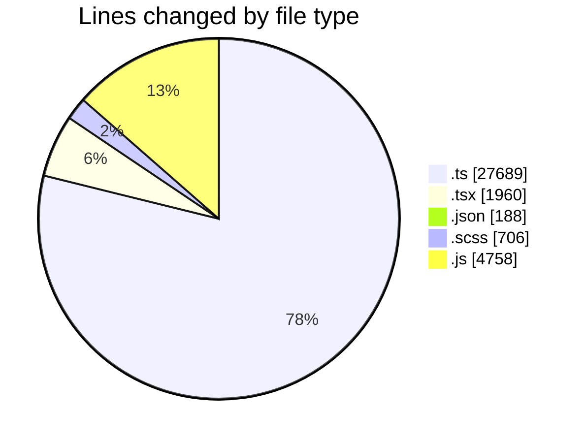
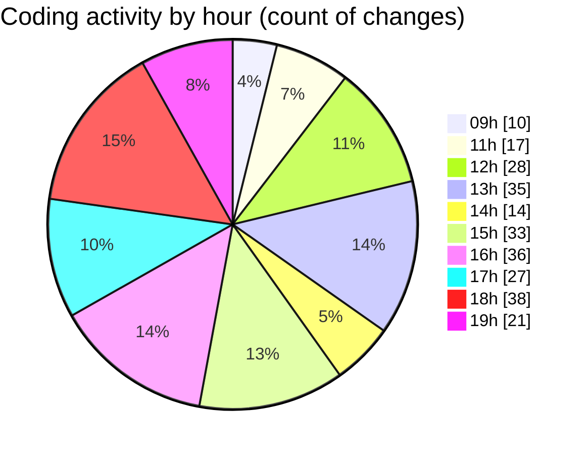

# cda - Activity Summary 

## Overall Statistics

| Stat                   | Value                                                             |
| ---------------------- | ----------------------------------------------------------------- |
| **Lines Added** (➕)   | 34645                                          |
| **Lines Removed** (➖) | 656                                        |
| **Net Change** (↕)    | 33989                |
| **Active Time** (⌚)   | 379 minutes |

## Modified Files
- **fieldUtils.ts** (+697, -67)
- **ConstructFieldContent.tsx** (+143, -29)
- **ConstructDefinitionListItem.tsx** (+159, -3)
- **settings.json** (+22, -0)
- **package.json** (+68, -0)
- **ProfilePublic.tsx** (+200, -0)
- **package.json** (+33, -0)
- **DescriptionList.tsx** (+310, -50)
- **global.d.ts** (+7, -5)
- **package.json** (+65, -0)
- **DescriptionList.scss** (+579, -127)
- **DescriptionList.stories.tsx** (+768, -11)
- **DescriptionListItem.tsx** (+102, -6)
- **peopleview.js** (+909, -8)
- **resolvers-types.ts** (+15125, -0)
- **queries.ts** (+1623, -5)
- **graphql.ts** (+8561, -0)
- **gql.ts** (+224, -0)
- **peopleview-queries.js** (+1692, -68)
- **peopleview-mutations.js** (+1935, -146)
- **ProfileFields.types.ts** (+129, -8)
- **profileFieldsConfig.ts** (+520, -12)
- **ConstructAction.tsx** (+45, -16)
- **UserLink.tsx** (+24, -0)
- **ConstructAction.test.tsx** (+68, -26)
- **fieldUtils.test.ts** (+321, -60)
- **Profile.types.ts** (+316, -9)

## Visualizations

### By File Type (Lines Changed)

### By Hour (Estimated Activity Count)

> **Last Updated:** 07/05/2026, 19:45:30