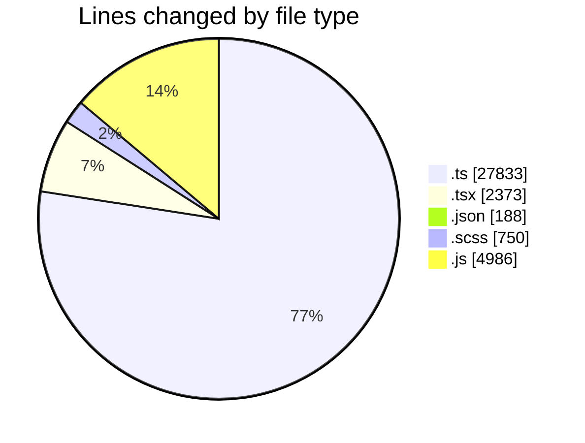
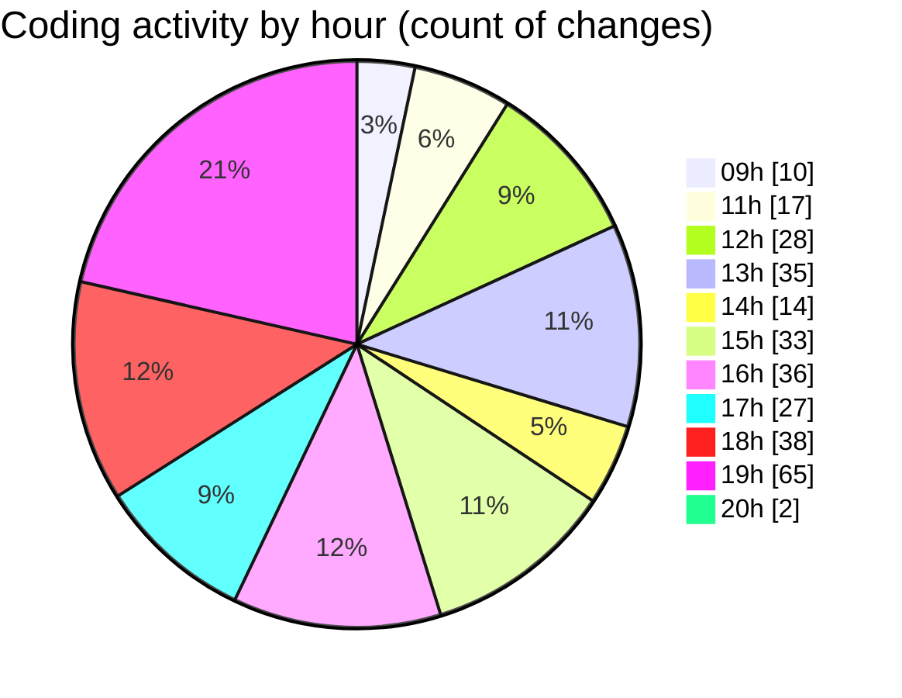

# cda - Activity Summary 

## Overall Statistics

| Stat                   | Value                                                             |
| ---------------------- | ----------------------------------------------------------------- |
| **Lines Added** (➕)   | 35135                                          |
| **Lines Removed** (➖) | 995                                        |
| **Net Change** (↕)    | 34140                |
| **Active Time** (⌚)   | 443 minutes |

## Modified Files
- **fieldUtils.ts** (+717, -87)
- **ConstructFieldContent.tsx** (+157, -43)
- **ConstructDefinitionListItem.tsx** (+200, -4)
- **settings.json** (+22, -0)
- **package.json** (+68, -0)
- **ProfilePublic.tsx** (+200, -0)
- **package.json** (+33, -0)
- **DescriptionList.tsx** (+348, -130)
- **global.d.ts** (+7, -5)
- **package.json** (+65, -0)
- **DescriptionList.scss** (+594, -156)
- **DescriptionList.stories.tsx** (+777, -19)
- **DescriptionListItem.tsx** (+102, -6)
- **peopleview.js** (+916, -15)
- **resolvers-types.ts** (+15125, -0)
- **queries.ts** (+1631, -13)
- **graphql.ts** (+8561, -0)
- **gql.ts** (+224, -0)
- **peopleview-queries.js** (+1726, -102)
- **peopleview-mutations.js** (+2008, -219)
- **ProfileFields.types.ts** (+133, -12)
- **profileFieldsConfig.ts** (+526, -18)
- **ConstructAction.tsx** (+53, -24)
- **UserLink.tsx** (+24, -0)
- **ConstructAction.test.tsx** (+81, -39)
- **fieldUtils.test.ts** (+351, -90)
- **Profile.types.ts** (+320, -13)
- **ConnectionsProvider.tsx** (+100, -0)
- **App.tsx** (+66, -0)

## Visualizations

### By File Type (Lines Changed)

### By Hour (Estimated Activity Count)

> **Last Updated:** 07/05/2026, 20:00:30