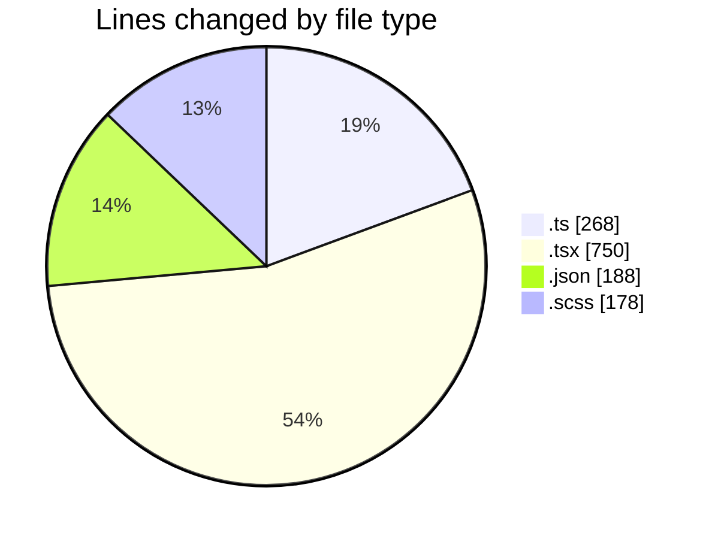
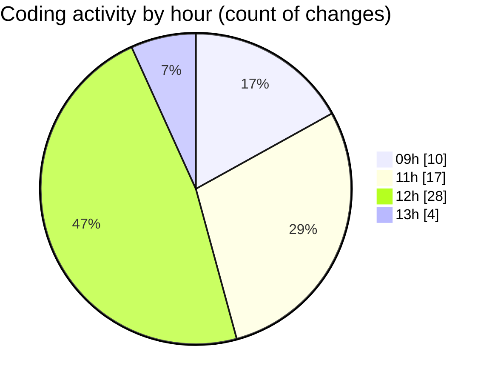

# cda - Activity Summary 

## Overall Statistics

| Stat                   | Value                                                             |
| ---------------------- | ----------------------------------------------------------------- |
| **Lines Added** (➕)   | 1336                                          |
| **Lines Removed** (➖) | 48                                        |
| **Net Change** (↕)    | 1288                |
| **Active Time** (⌚)   | 76 minutes |

## Modified Files
- **fieldUtils.ts** (+233, -23)
- **ConstructFieldContent.tsx** (+1, -1)
- **ConstructDefinitionListItem.tsx** (+1, -1)
- **settings.json** (+22, -0)
- **package.json** (+68, -0)
- **ProfilePublic.tsx** (+200, -0)
- **package.json** (+33, -0)
- **DescriptionList.tsx** (+111, -2)
- **global.d.ts** (+7, -5)
- **package.json** (+65, -0)
- **DescriptionList.scss** (+166, -12)
- **DescriptionList.stories.tsx** (+381, -4)
- **DescriptionListItem.tsx** (+48, -0)

## Visualizations

### By File Type (Lines Changed)

### By Hour (Estimated Activity Count)

> **Last Updated:** 07/05/2026, 13:18:15