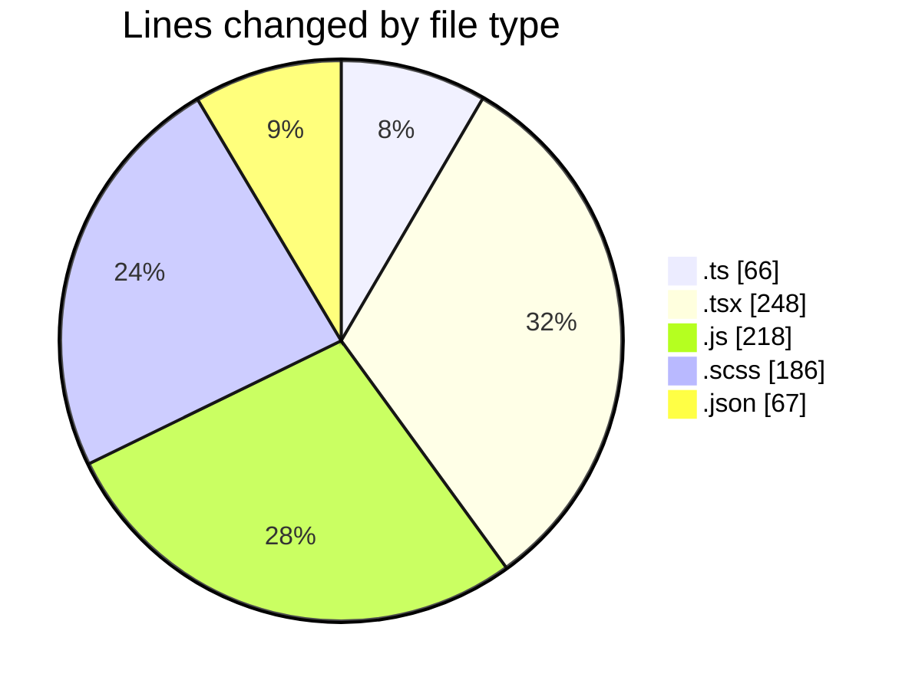
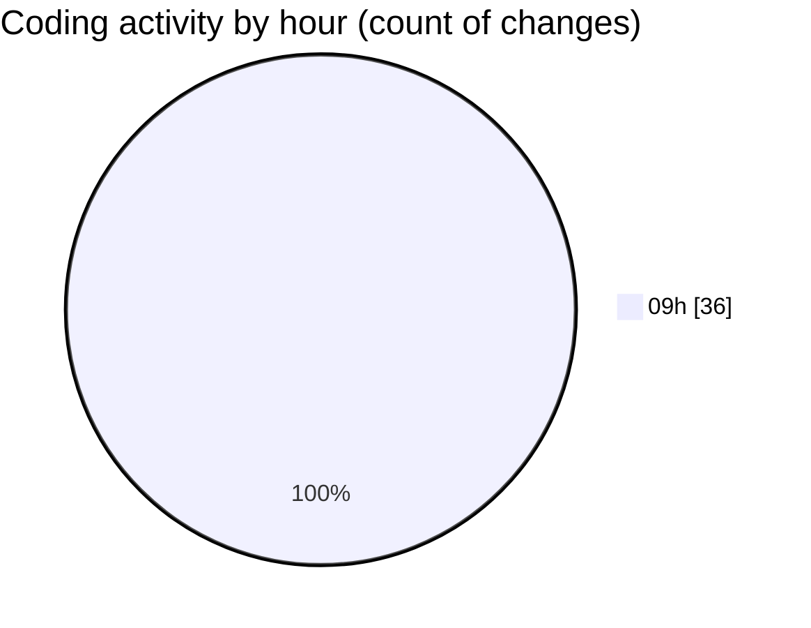

# cda - Activity Summary 

## Overall Statistics

| Stat                   | Value                                                             |
| ---------------------- | ----------------------------------------------------------------- |
| **Lines Added** (➕)   | 571                                          |
| **Lines Removed** (➖) | 214                                        |
| **Net Change** (↕)    | 357                |
| **Active Time** (⌚)   | 55 minutes |

## Modified Files
- **ProfileFields.types.ts** (+1, -2)
- **fieldUtils.ts** (+1, -2)
- **profileFieldsConfig.ts** (+1, -2)
- **ConstructFieldContent.tsx** (+9, -18)
- **queries.ts** (+19, -38)
- **peopleview.js** (+16, -32)
- **DescriptionList.scss** (+124, -62)
- **DescriptionList.tsx** (+33, -33)
- **DescriptionList.stories.tsx** (+19, -19)
- **index.js** (+170, -0)
- **package.json** (+67, -0)
- **BankDetailsPanel.tsx** (+101, -2)
- **ProfileFields.tsx** (+10, -4)

## Visualizations

### By File Type (Lines Changed)

### By Hour (Estimated Activity Count)

> **Last Updated:** 08/05/2026, 09:25:31