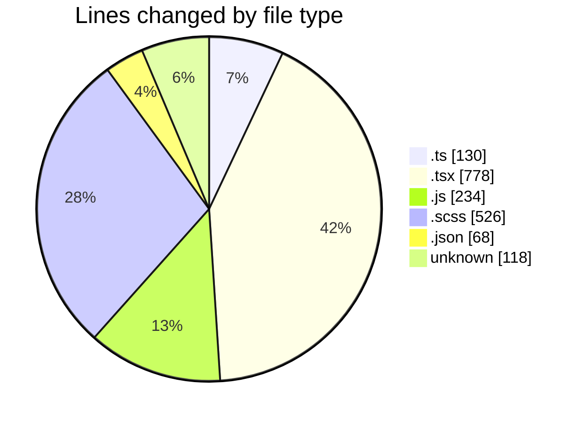
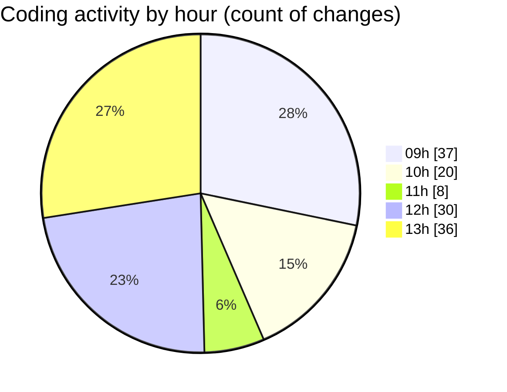

# cda - Activity Summary 

## Overall Statistics

| Stat                   | Value                                                             |
| ---------------------- | ----------------------------------------------------------------- |
| **Lines Added** (➕)   | 1366                                          |
| **Lines Removed** (➖) | 488                                        |
| **Net Change** (↕)    | 878                |
| **Active Time** (⌚)   | 181 minutes |

## Modified Files
- **ProfileFields.types.ts** (+2, -2)
- **fieldUtils.ts** (+22, -22)
- **profileFieldsConfig.ts** (+2, -2)
- **ConstructFieldContent.tsx** (+18, -18)
- **queries.ts** (+38, -38)
- **peopleview.js** (+32, -32)
- **DescriptionList.scss** (+289, -237)
- **DescriptionList.tsx** (+82, -68)
- **DescriptionList.stories.tsx** (+168, -37)
- **index.js** (+170, -0)
- **package.json** (+67, -1)
- **BankDetailsPanel.tsx** (+101, -12)
- **ProfileFields.tsx** (+10, -10)
- **ProfilePublic.tsx** (+200, -0)
- **.env** (+118, -0)
- **ConstructFieldRows.tsx** (+29, -6)
- **PersonalDetailsPanel.tsx** (+3, -3)
- **calculateTermWidth.ts** (+2, -0)
- **DescriptionListItem.tsx** (+13, -0)

## Visualizations

### By File Type (Lines Changed)

### By Hour (Estimated Activity Count)

> **Last Updated:** 08/05/2026, 13:55:31