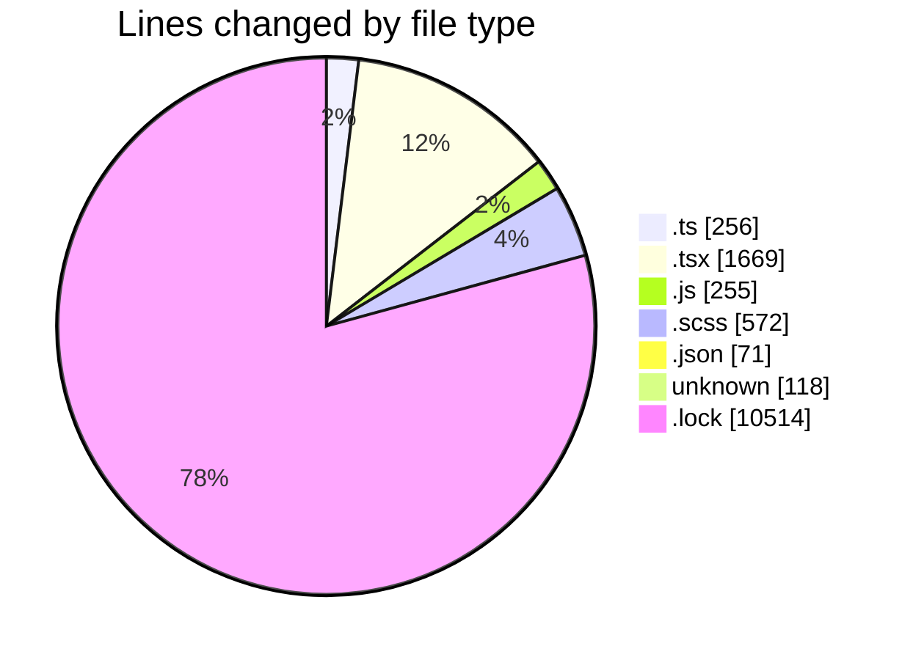
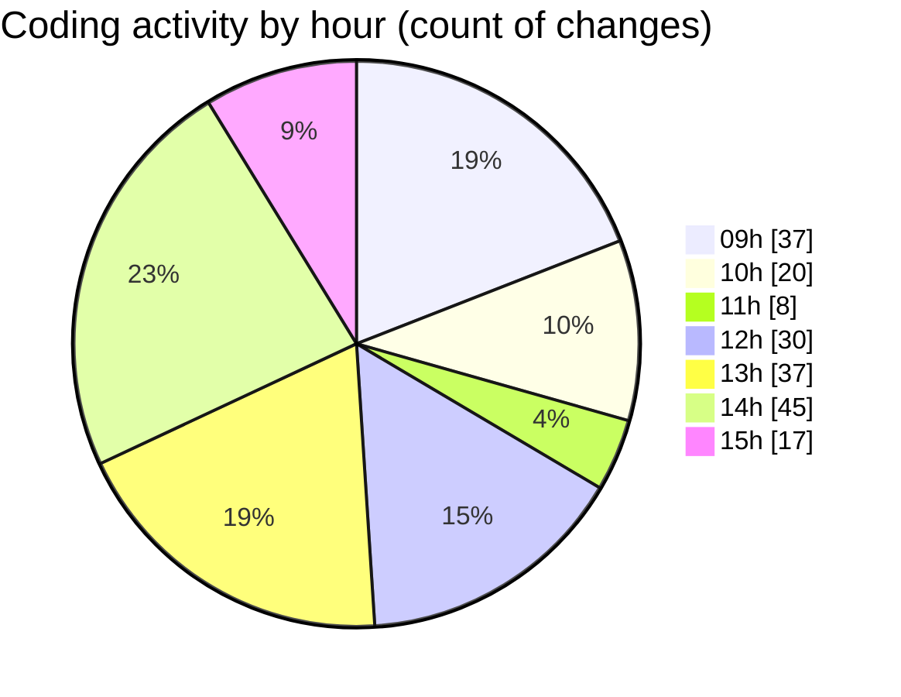

# cda - Activity Summary 

## Overall Statistics

| Stat                   | Value                                                             |
| ---------------------- | ----------------------------------------------------------------- |
| **Lines Added** (➕)   | 12434                                          |
| **Lines Removed** (➖) | 1021                                        |
| **Net Change** (↕)    | 11413                |
| **Active Time** (⌚)   | 218 minutes |

## Modified Files
- **ProfileFields.types.ts** (+10, -6)
- **fieldUtils.ts** (+62, -42)
- **profileFieldsConfig.ts** (+14, -8)
- **ConstructFieldContent.tsx** (+46, -32)
- **queries.ts** (+54, -46)
- **peopleview.js** (+46, -39)
- **DescriptionList.scss** (+317, -255)
- **DescriptionList.tsx** (+129, -162)
- **DescriptionList.stories.tsx** (+323, -342)
- **index.js** (+170, -0)
- **package.json** (+69, -2)
- **BankDetailsPanel.tsx** (+119, -21)
- **ProfileFields.tsx** (+22, -16)
- **ProfilePublic.tsx** (+200, -0)
- **.env** (+118, -0)
- **ConstructFieldRows.tsx** (+29, -6)
- **PersonalDetailsPanel.tsx** (+9, -6)
- **calculateTermWidth.ts** (+2, -0)
- **DescriptionListItem.tsx** (+26, -26)
- **DescriptionList.test.tsx** (+131, -0)
- **yarn.lock** (+10514, -0)
- **ConstructAction.tsx** (+16, -8)
- **Profile.types.ts** (+8, -4)

## Visualizations

### By File Type (Lines Changed)

### By Hour (Estimated Activity Count)

> **Last Updated:** 08/05/2026, 15:15:31