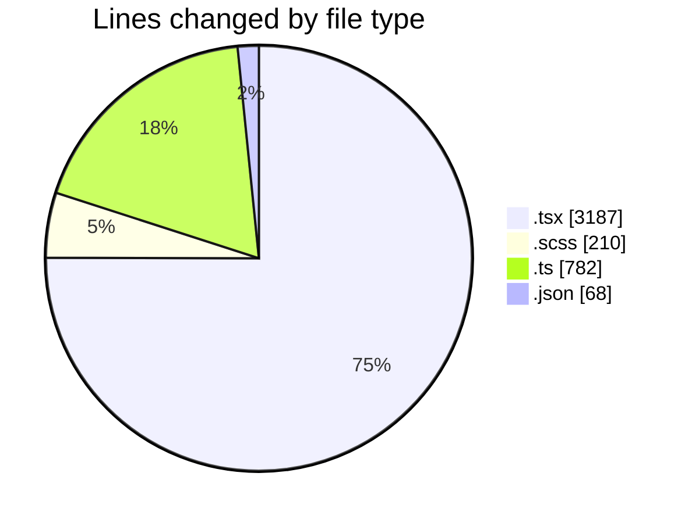
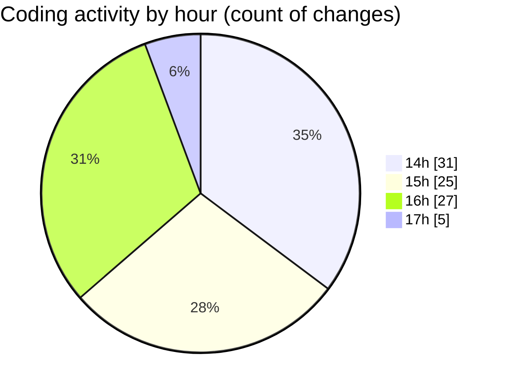

# cda - Activity Summary 

## Overall Statistics

| Stat                   | Value                                                             |
| ---------------------- | ----------------------------------------------------------------- |
| **Lines Added** (➕)   | 4136                                          |
| **Lines Removed** (➖) | 111                                        |
| **Net Change** (↕)    | 4025                |
| **Active Time** (⌚)   | 114 minutes |

## Modified Files
- **ProfilePublic.tsx** (+202, -2)
- **PublicDetailsPanel.tsx** (+185, -0)
- **ProfileFields.tsx** (+27, -3)
- **ConstructDefinitionListItem.tsx** (+108, -30)
- **BankDetailsPanel.tsx** (+153, -52)
- **DescriptionList.stories.tsx** (+370, -0)
- **DescriptionListItem.tsx** (+61, -0)
- **DescriptionList.tsx** (+137, -0)
- **DescriptionList.test.tsx** (+131, -0)
- **DescriptionList.scss** (+200, -10)
- **dfsdf.ts** (+41, -0)
- **AttachmentDetailsPanel.tsx** (+35, -0)
- **PersonalDetailsPanel.tsx** (+194, -4)
- **profileFieldsConfig.ts** (+515, -0)
- **fieldUtils.ts** (+226, -0)
- **ConstructFieldRows.tsx** (+53, -0)
- **ConstructFieldContent.tsx** (+97, -9)
- **EmploymentDetailsPanel.tsx** (+54, -0)
- **GenderPayPanel.tsx** (+139, -1)
- **NextOfKinPanel.tsx** (+57, -0)
- **EmergencyContactPanel.tsx** (+60, -0)
- **PersonalDetailsPanel.test.tsx** (+190, -0)
- **NextOfKinPanel.test.tsx** (+191, -0)
- **EmergencyContactPanel.test.tsx** (+191, -0)
- **package.json** (+68, -0)
- **Book.tsx** (+307, -0)
- **CreateBooking.tsx** (+144, -0)

## Visualizations

### By File Type (Lines Changed)

### By Hour (Estimated Activity Count)

> **Last Updated:** 11/05/2026, 17:15:46