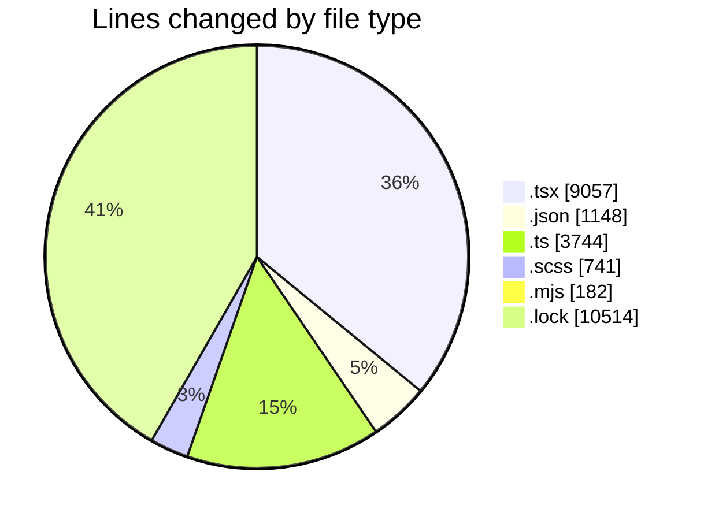
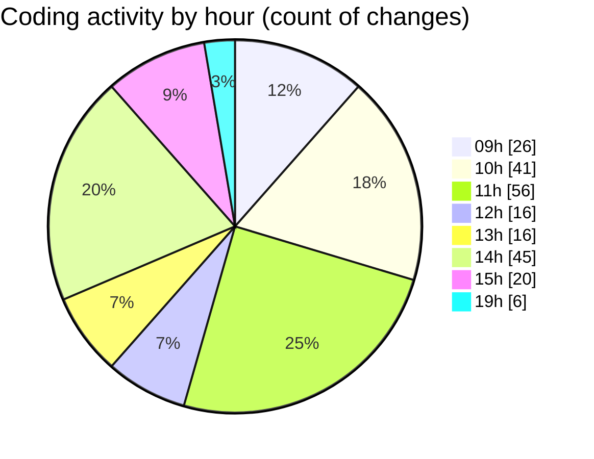

# cda - Activity Summary 

## Overall Statistics

| Stat                   | Value                                                             |
| ---------------------- | ----------------------------------------------------------------- |
| **Lines Added** (➕)   | 24742                                          |
| **Lines Removed** (➖) | 644                                        |
| **Net Change** (↕)    | 24098                |
| **Active Time** (⌚)   | 281 minutes |

## Modified Files
- **CreateBooking.tsx** (+1083, -364)
- **package.json** (+204, -0)
- **profileFieldsConfig.ts** (+2573, -1)
- **ConstructFieldContent.tsx** (+406, -17)
- **ConstructFieldRows.tsx** (+205, -30)
- **fieldUtils.ts** (+1128, -1)
- **ProfileFields.tsx** (+114, -3)
- **ConstructDefinitionListItem.tsx** (+394, -1)
- **DescriptionList.stories.tsx** (+2636, -103)
- **AttachmentDetailsPanel.tsx** (+169, -3)
- **PublicDetailsPanel.tsx** (+921, -2)
- **BankDetailsPanel.tsx** (+481, -12)
- **EmergencyContactPanel.test.tsx** (+185, -0)
- **package.json** (+746, -2)
- **card.scss** (+117, -0)
- **alert.scss** (+29, -0)
- **package.json** (+134, -0)
- **rollup.config.mjs** (+163, -19)
- **tsconfig.json** (+55, -7)
- **DescriptionList.scss** (+562, -33)
- **DescriptionList.test.tsx** (+524, -29)
- **yarn.lock** (+10514, -0)
- **DescriptionListItem.tsx** (+48, -0)
- **DescriptionList.tsx** (+396, -6)
- **PersonalDetailsPanel.tsx** (+190, -0)
- **EmergencyContactPanel.tsx** (+60, -0)
- **EmploymentDetailsPanel.tsx** (+58, -0)
- **HoursAndPayPanel.tsx** (+77, -4)
- **NextOfKinPanel.tsx** (+57, -0)
- **DisabilityPayPanel.tsx** (+100, -0)
- **EthnicityPayPanel.tsx** (+111, -0)
- **GenderPayPanel.tsx** (+138, -0)
- **calculateTermWidth.test.tsx** (+123, -7)
- **calculateTermWidth.ts** (+41, -0)

## Visualizations

### By File Type (Lines Changed)

### By Hour (Estimated Activity Count)

> **Last Updated:** 12/05/2026, 20:00:10