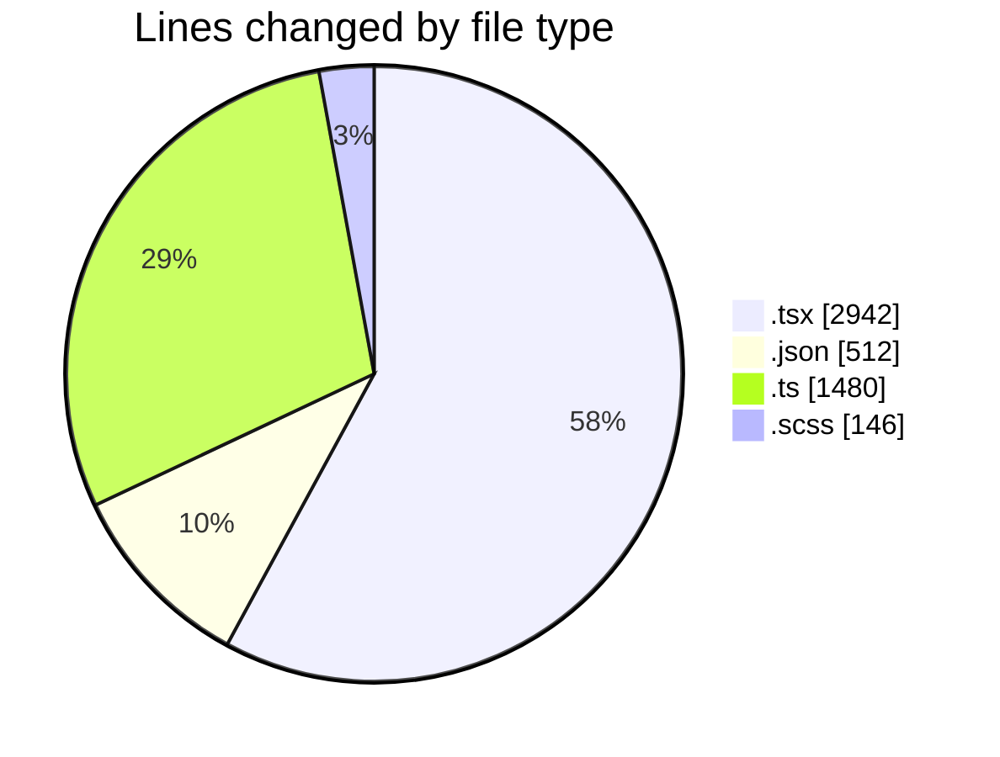
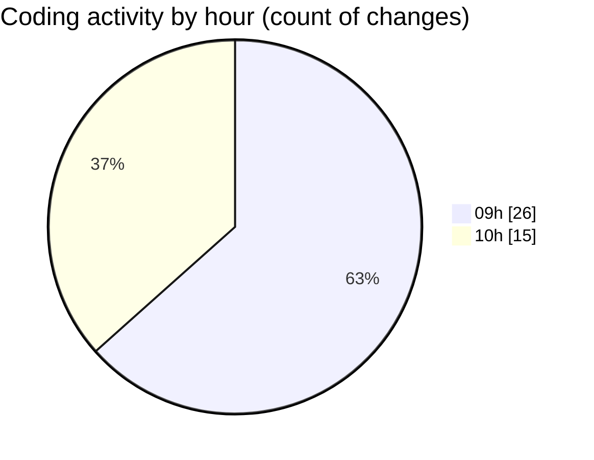

# cda - Activity Summary 

## Overall Statistics

| Stat                   | Value                                                             |
| ---------------------- | ----------------------------------------------------------------- |
| **Lines Added** (➕)   | 4784                                          |
| **Lines Removed** (➖) | 296                                        |
| **Net Change** (↕)    | 4488                |
| **Active Time** (⌚)   | 39 minutes |

## Modified Files
- **CreateBooking.tsx** (+588, -294)
- **package.json** (+136, -0)
- **profileFieldsConfig.ts** (+1029, -0)
- **ConstructFieldContent.tsx** (+159, -0)
- **ConstructFieldRows.tsx** (+76, -0)
- **fieldUtils.ts** (+451, -0)
- **ProfileFields.tsx** (+45, -0)
- **ConstructDefinitionListItem.tsx** (+157, -0)
- **DescriptionList.stories.tsx** (+813, -0)
- **AttachmentDetailsPanel.tsx** (+67, -0)
- **PublicDetailsPanel.tsx** (+368, -0)
- **BankDetailsPanel.tsx** (+190, -0)
- **EmergencyContactPanel.test.tsx** (+185, -0)
- **package.json** (+374, -2)
- **card.scss** (+117, -0)
- **alert.scss** (+29, -0)

## Visualizations

### By File Type (Lines Changed)

### By Hour (Estimated Activity Count)

> **Last Updated:** 12/05/2026, 10:28:38