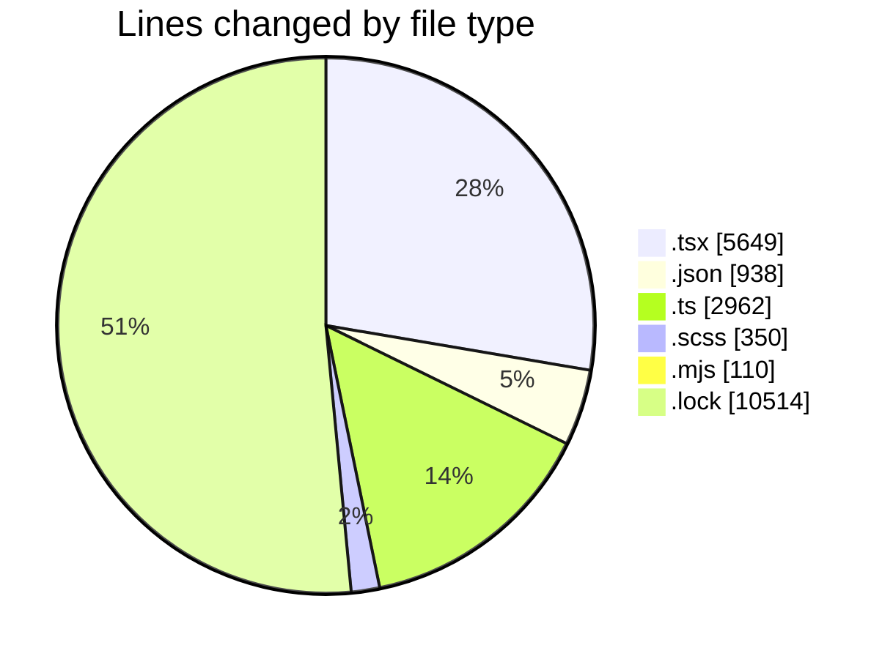
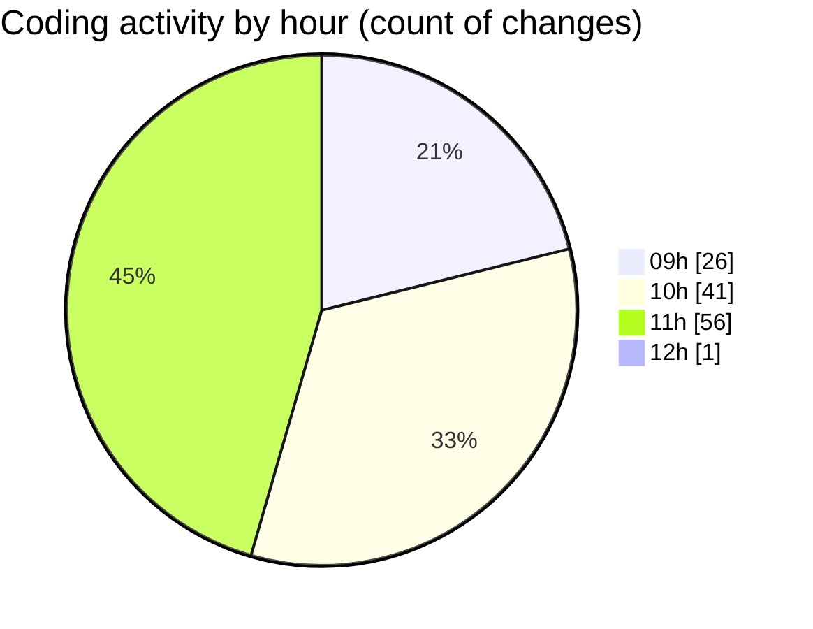

# cda - Activity Summary 

## Overall Statistics

| Stat                   | Value                                                             |
| ---------------------- | ----------------------------------------------------------------- |
| **Lines Added** (➕)   | 20056                                          |
| **Lines Removed** (➖) | 467                                        |
| **Net Change** (↕)    | 19589                |
| **Active Time** (⌚)   | 180 minutes |

## Modified Files
- **CreateBooking.tsx** (+941, -363)
- **package.json** (+204, -0)
- **profileFieldsConfig.ts** (+2059, -0)
- **ConstructFieldContent.tsx** (+335, -0)
- **ConstructFieldRows.tsx** (+182, -0)
- **fieldUtils.ts** (+903, -0)
- **ProfileFields.tsx** (+93, -0)
- **ConstructDefinitionListItem.tsx** (+314, -1)
- **DescriptionList.stories.tsx** (+1626, -73)
- **AttachmentDetailsPanel.tsx** (+137, -0)
- **PublicDetailsPanel.tsx** (+738, -0)
- **BankDetailsPanel.tsx** (+392, -0)
- **EmergencyContactPanel.test.tsx** (+185, -0)
- **package.json** (+560, -2)
- **card.scss** (+117, -0)
- **alert.scss** (+29, -0)
- **package.json** (+134, -0)
- **rollup.config.mjs** (+91, -19)
- **tsconfig.json** (+31, -7)
- **DescriptionList.scss** (+202, -2)
- **DescriptionList.test.tsx** (+131, -0)
- **yarn.lock** (+10514, -0)
- **DescriptionListItem.tsx** (+48, -0)
- **DescriptionList.tsx** (+90, -0)

## Visualizations

### By File Type (Lines Changed)

### By Hour (Estimated Activity Count)

> **Last Updated:** 12/05/2026, 12:01:53