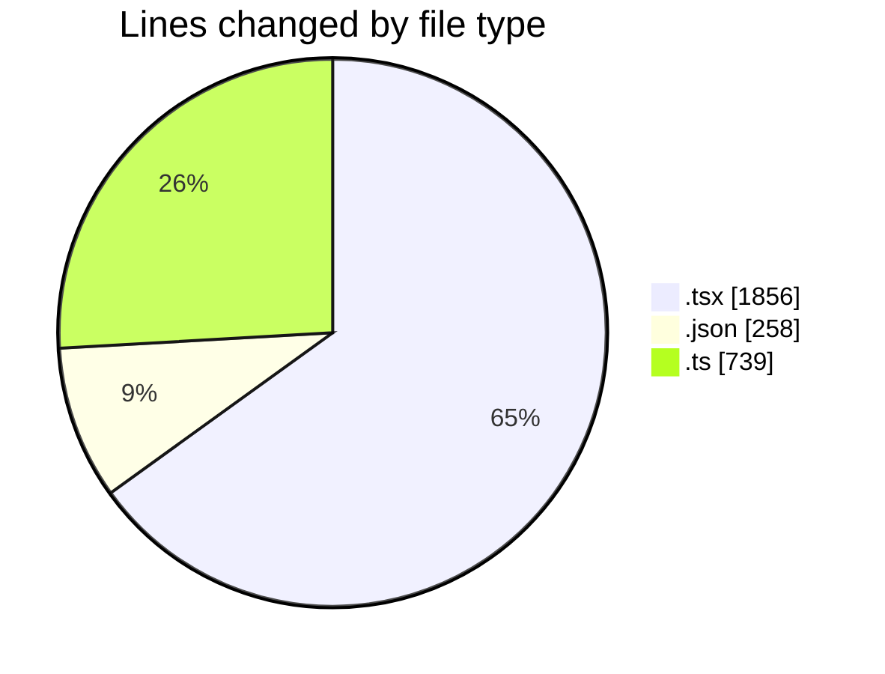
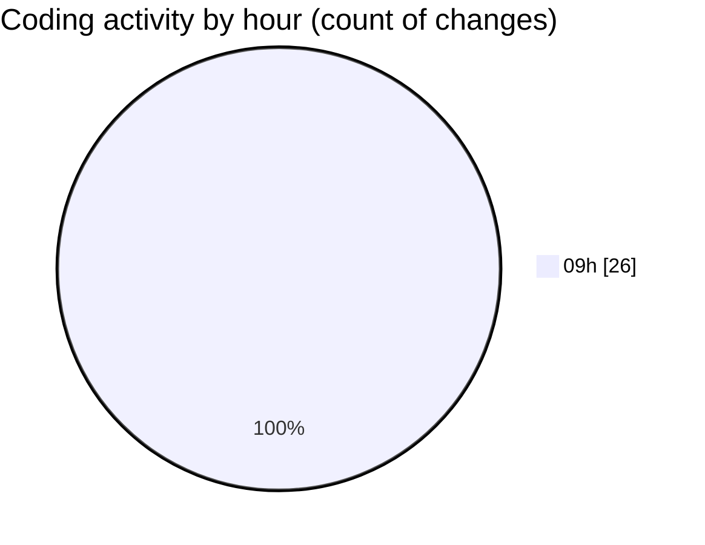

# cda - Activity Summary 

## Overall Statistics

| Stat                   | Value                                                             |
| ---------------------- | ----------------------------------------------------------------- |
| **Lines Added** (➕)   | 2557                                          |
| **Lines Removed** (➖) | 296                                        |
| **Net Change** (↕)    | 2261                |
| **Active Time** (⌚)   | 36 minutes |

## Modified Files
- **CreateBooking.tsx** (+436, -294)
- **package.json** (+68, -0)
- **profileFieldsConfig.ts** (+514, -0)
- **ConstructFieldContent.tsx** (+71, -0)
- **ConstructFieldRows.tsx** (+23, -0)
- **fieldUtils.ts** (+225, -0)
- **ProfileFields.tsx** (+21, -0)
- **ConstructDefinitionListItem.tsx** (+79, -0)
- **DescriptionList.stories.tsx** (+443, -0)
- **AttachmentDetailsPanel.tsx** (+32, -0)
- **PublicDetailsPanel.tsx** (+183, -0)
- **BankDetailsPanel.tsx** (+89, -0)
- **EmergencyContactPanel.test.tsx** (+185, -0)
- **package.json** (+188, -2)

## Visualizations

### By File Type (Lines Changed)

### By Hour (Estimated Activity Count)

> **Last Updated:** 12/05/2026, 09:51:31