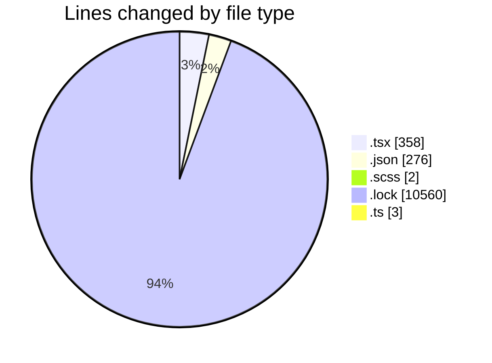
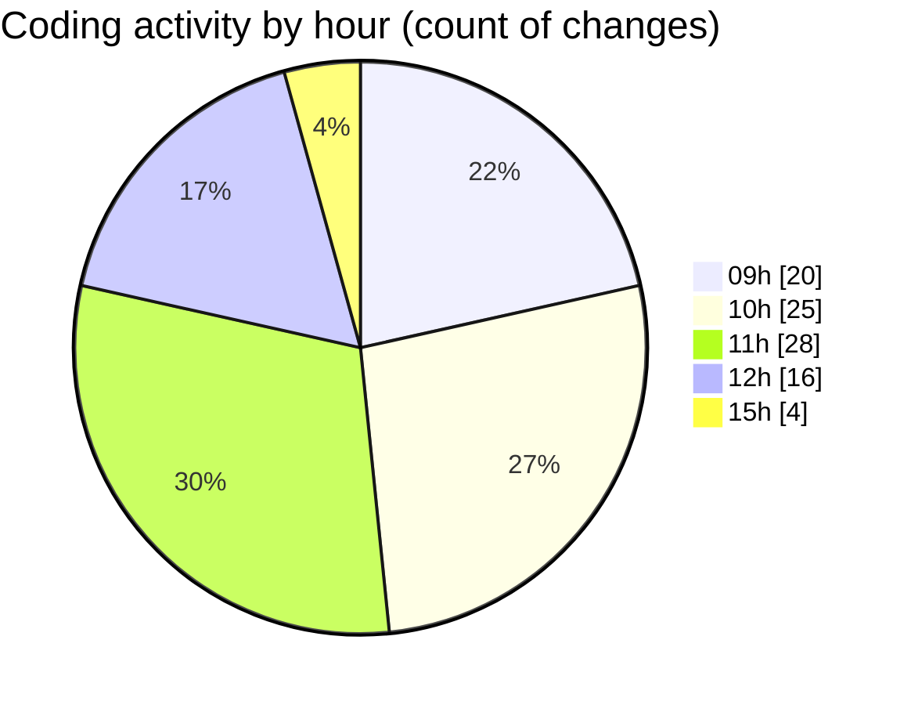

# cda - Activity Summary 

## Overall Statistics

| Stat                   | Value                                                             |
| ---------------------- | ----------------------------------------------------------------- |
| **Lines Added** (➕)   | 11024                                          |
| **Lines Removed** (➖) | 175                                        |
| **Net Change** (↕)    | 10849                |
| **Active Time** (⌚)   | 136 minutes |

## Modified Files
- **DescriptionList.stories.tsx** (+127, -131)
- **settings.json** (+88, -2)
- **DescriptionList.scss** (+1, -1)
- **DescriptionList.tsx** (+13, -22)
- **DescriptionListItem.tsx** (+63, -2)
- **package.json** (+186, -0)
- **yarn.lock** (+10543, -17)
- **global.d.ts** (+3, -0)

## Visualizations

### By File Type (Lines Changed)

### By Hour (Estimated Activity Count)

> **Last Updated:** 13/05/2026, 15:23:32