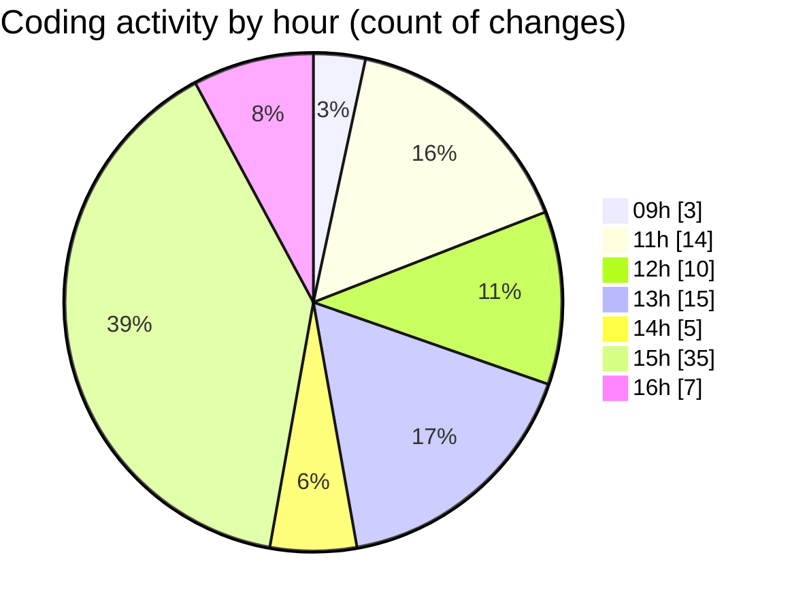

# cda - Activity Summary 

## Overall Statistics

| Stat                   | Value                                                             |
| ---------------------- | ----------------------------------------------------------------- |
| **Lines Added** (➕)   | 26796                                          |
| **Lines Removed** (➖) | 393                                        |
| **Net Change** (↕)    | 26403                |
| **Active Time** (⌚)   | 113 minutes |

## Modified Files
- **settings.json** (+88, -0)
- **package.json** (+74, -0)
- **yarn.lock** (+13858, -94)
- **BusinessCard.tsx** (+139, -0)
- **FaultCodeToolTip.tsx** (+34, -2)
- **settings.json** (+22, -0)
- **Faults.tsx** (+391, -9)
- **Home.tsx** (+219, -9)
- **CondensedFaultTable.tsx** (+225, -6)
- **Tooltip.test.tsx** (+237, -0)
- **index.ts** (+74, -71)
- **tooltip copy.scss** (+47, -0)
- **Tooltip.stories.tsx** (+369, -105)
- **package.json** (+200, -21)
- **Tooltip.scss** (+49, -4)
- **yarn.lock** (+10509, -0)
- **Tooltip.tsx** (+124, -72)
- **App.tsx** (+137, -0)

## Visualizations

### By File Type (Lines Changed)

### By Hour (Estimated Activity Count)

> **Last Updated:** 14/05/2026, 16:37:27