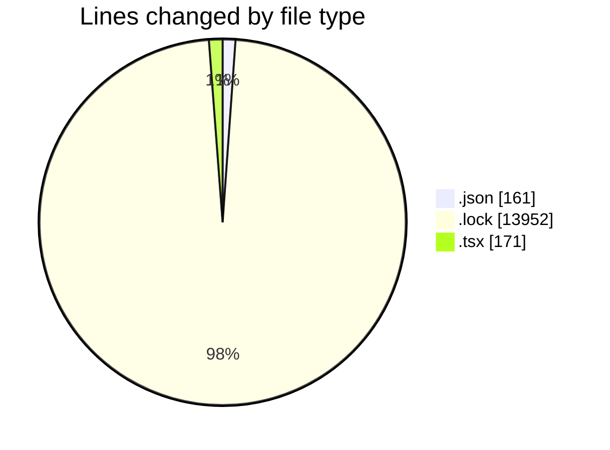
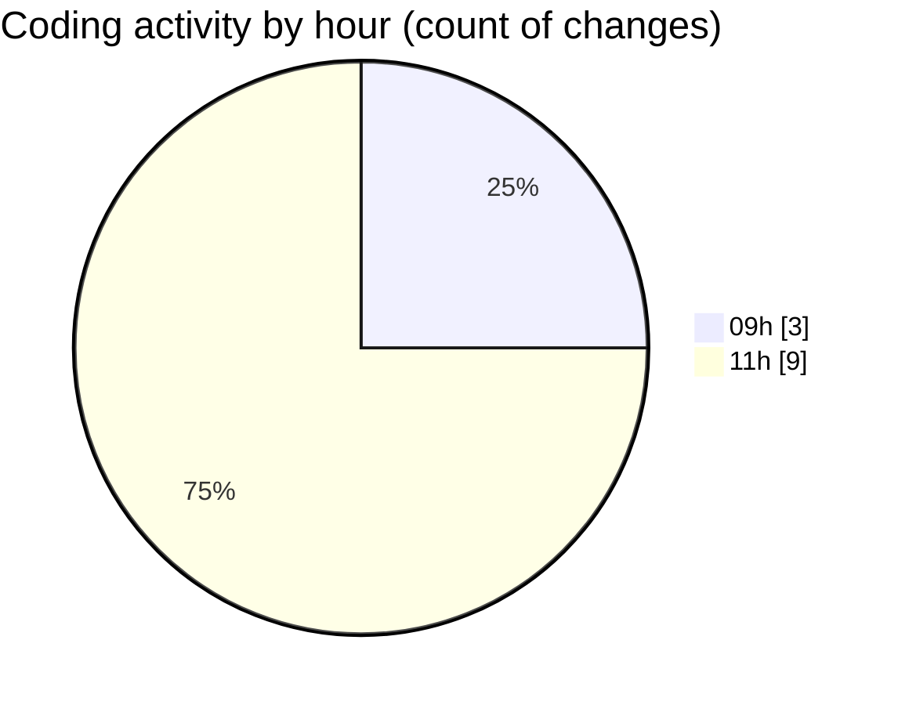

# cda - Activity Summary 

## Overall Statistics

| Stat                   | Value                                                             |
| ---------------------- | ----------------------------------------------------------------- |
| **Lines Added** (➕)   | 14190                                          |
| **Lines Removed** (➖) | 94                                        |
| **Net Change** (↕)    | 14096                |
| **Active Time** (⌚)   | 9 minutes |

## Modified Files
- **settings.json** (+88, -0)
- **package.json** (+73, -0)
- **yarn.lock** (+13858, -94)
- **BusinessCard.tsx** (+139, -0)
- **FaultCodeToolTip.tsx** (+32, -0)

## Visualizations

### By File Type (Lines Changed)

### By Hour (Estimated Activity Count)

> **Last Updated:** 14/05/2026, 11:37:26