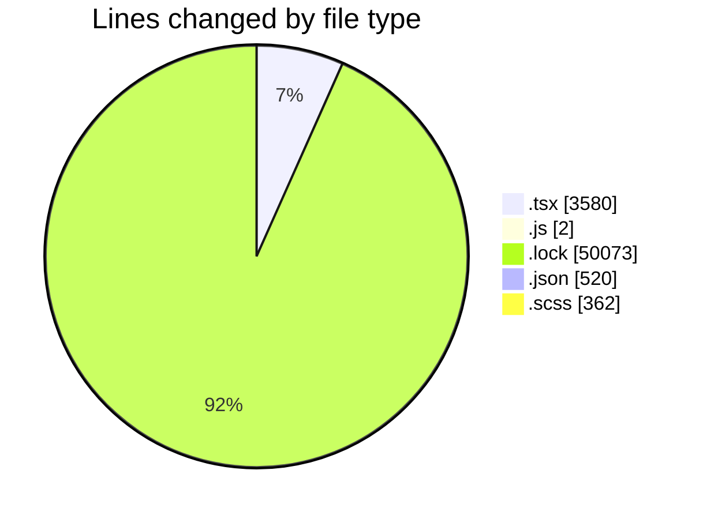
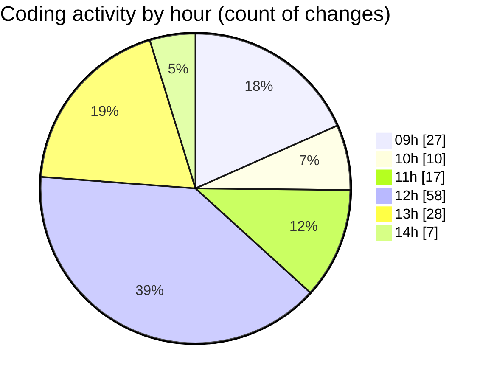

# cda - Activity Summary 

## Overall Statistics

| Stat                   | Value                                                             |
| ---------------------- | ----------------------------------------------------------------- |
| **Lines Added** (➕)   | 53468                                          |
| **Lines Removed** (➖) | 1069                                        |
| **Net Change** (↕)    | 52399                |
| **Active Time** (⌚)   | 206 minutes |

## Modified Files
- **TooltipHost.tsx** (+39, -9)
- **Tooltip.tsx** (+42, -24)
- **index.js** (+0, -2)
- **Tooltip.test.tsx** (+69, -101)
- **Tooltip.stories.tsx** (+3, -112)
- **yarn.lock** (+21550, -493)
- **package.json** (+147, -1)
- **package.json** (+372, -0)
- **Home.tsx** (+406, -0)
- **yarn.lock** (+27841, -189)
- **CondensedFaultTable.tsx** (+221, -1)
- **EndCodeToolTip.tsx** (+34, -2)
- **FaultCodeToolTip.tsx** (+33, -1)
- **FaultsTable.tsx** (+219, -1)
- **HistoricServiceImpactToolTips.tsx** (+42, -0)
- **LocalDabFaultsTable.tsx** (+176, -2)
- **PlannedWorksIcon.tsx** (+28, -5)
- **HistoricPlannedWorkTable.tsx** (+181, -28)
- **RequestsTable.tsx** (+201, -20)
- **FaultsTable.test.tsx** (+119, -0)
- **CondensedFaultTable.test.tsx** (+87, -0)
- **RequestsTable.test.tsx** (+52, -0)
- **Faults.test.tsx** (+452, -0)
- **Home.test.tsx** (+259, -0)
- **Tooltip.scss** (+47, -0)
- **DescriptionList.stories.tsx** (+534, -77)
- **_alignment.scss** (+140, -0)
- **DescriptionList.scss** (+174, -1)

## Visualizations

### By File Type (Lines Changed)

### By Hour (Estimated Activity Count)

> **Last Updated:** 15/05/2026, 14:10:55