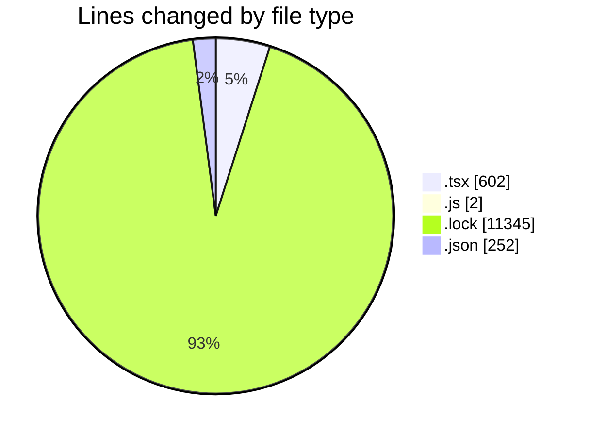
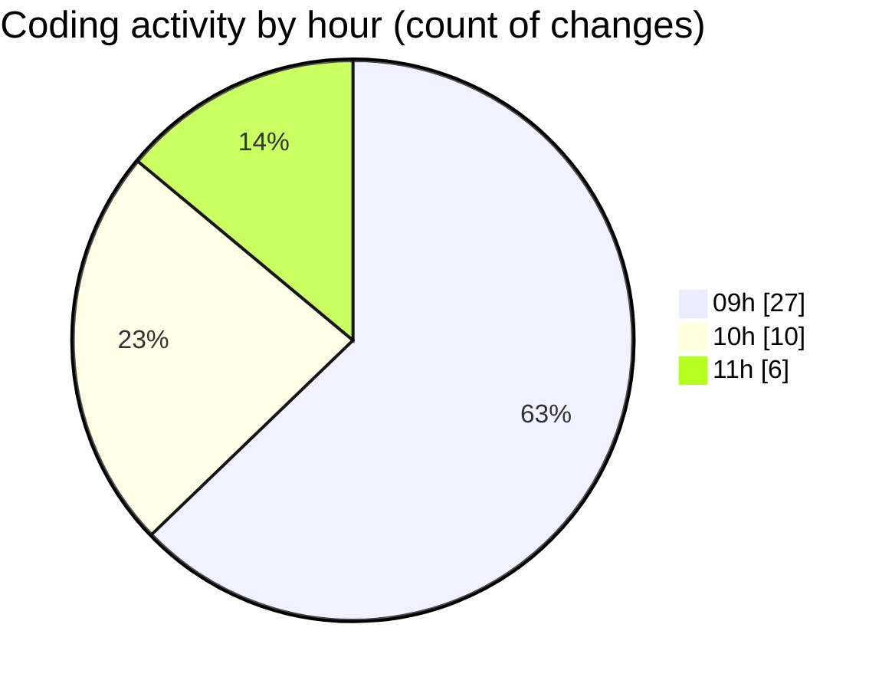

# cda - Activity Summary 

## Overall Statistics

| Stat                   | Value                                                             |
| ---------------------- | ----------------------------------------------------------------- |
| **Lines Added** (➕)   | 11465                                          |
| **Lines Removed** (➖) | 736                                        |
| **Net Change** (↕)    | 10729                |
| **Active Time** (⌚)   | 61 minutes |

## Modified Files
- **TooltipHost.tsx** (+39, -9)
- **Tooltip.tsx** (+42, -24)
- **index.js** (+0, -2)
- **Tooltip.test.tsx** (+69, -101)
- **Tooltip.stories.tsx** (+3, -112)
- **yarn.lock** (+10857, -488)
- **package.json** (+73, -0)
- **package.json** (+179, -0)
- **Home.tsx** (+203, -0)

## Visualizations

### By File Type (Lines Changed)

### By Hour (Estimated Activity Count)

> **Last Updated:** 15/05/2026, 11:33:07