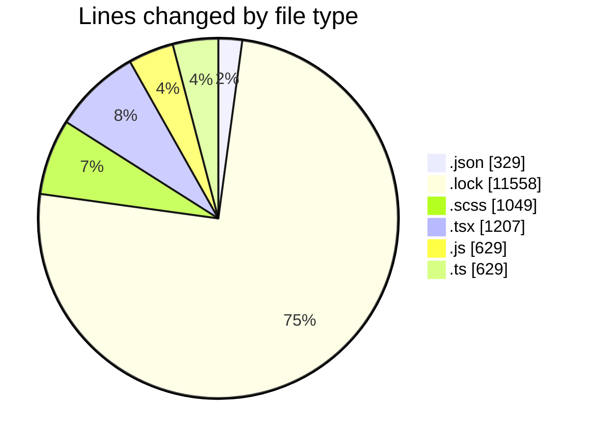
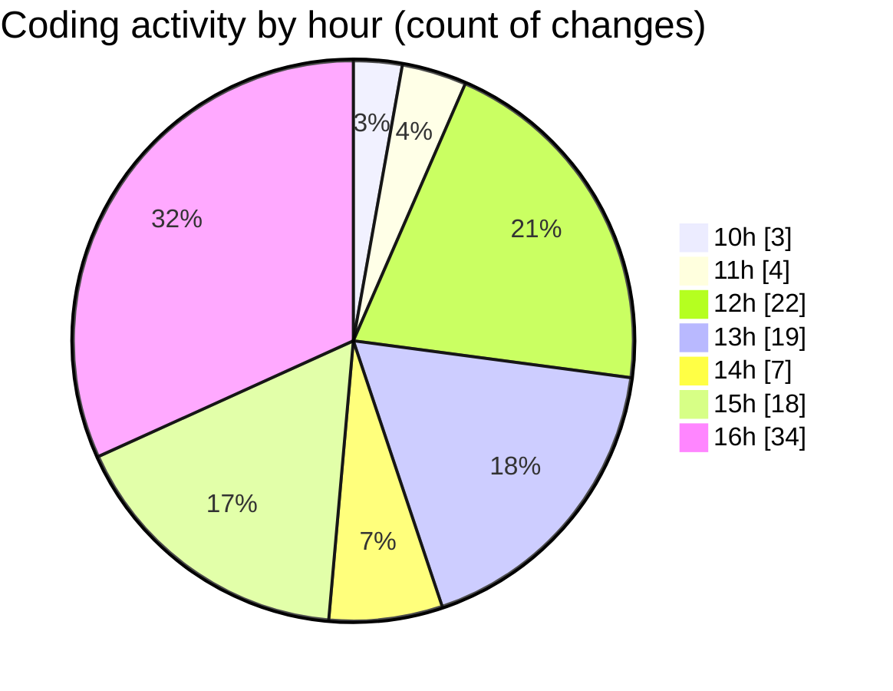

# cda - Activity Summary 

## Overall Statistics

| Stat                   | Value                                                             |
| ---------------------- | ----------------------------------------------------------------- |
| **Lines Added** (➕)   | 14669                                          |
| **Lines Removed** (➖) | 732                                        |
| **Net Change** (↕)    | 13937                |
| **Active Time** (⌚)   | 158 minutes |

## Modified Files
- **package.json** (+188, -2)
- **package.json** (+73, -0)
- **yarn.lock** (+11210, -348)
- **Tooltip.scss** (+49, -2)
- **TooltipHost.tsx** (+90, -20)
- **Tooltip.tsx** (+106, -30)
- **index.js** (+46, -0)
- **index.tsx** (+162, -41)
- **index.tsx** (+134, -9)
- **badge.scss** (+470, -91)
- **statsBox.scss** (+347, -90)
- **Tooltip.test.tsx** (+231, -31)
- **Tooltip.stories.tsx** (+200, -5)
- **Badge.stories.js** (+215, -12)
- **badge.test.js** (+78, -32)
- **StatsBox.stories.js** (+245, -1)
- **client.d.ts** (+106, -0)
- **package.json** (+66, -0)
- **PersonCard.tsx** (+92, -3)
- **TreeLeaf.tsx** (+26, -1)
- **TreeBranch.tsx** (+21, -5)
- **index.ts** (+514, -9)

## Visualizations

### By File Type (Lines Changed)

### By Hour (Estimated Activity Count)

> **Last Updated:** 18/05/2026, 16:47:24