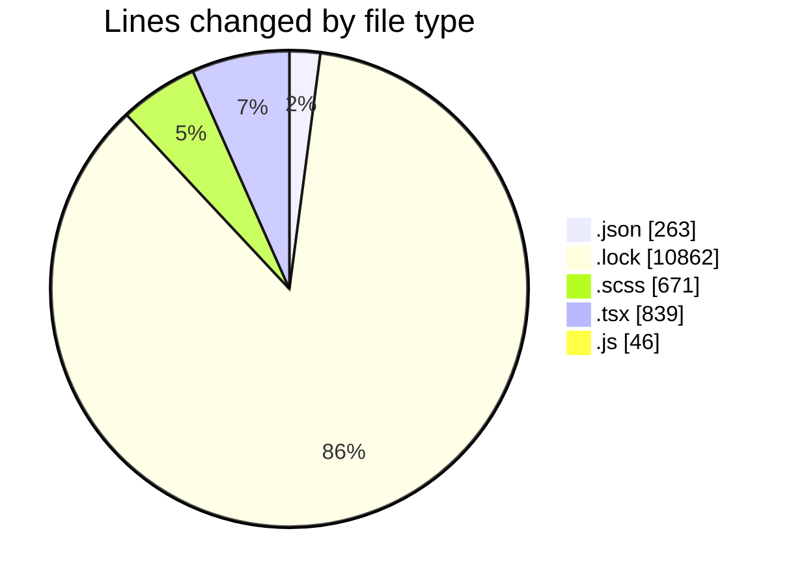
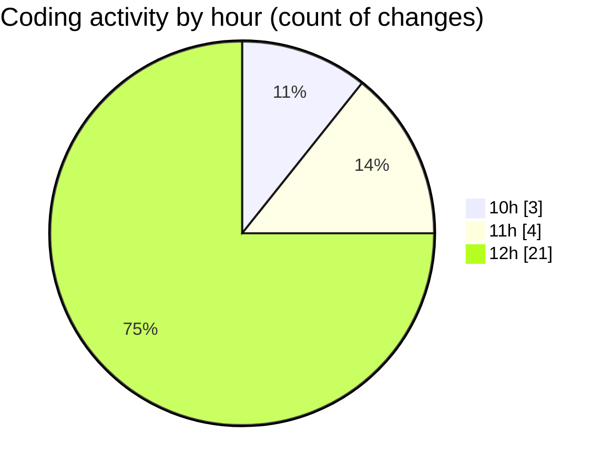

# cda - Activity Summary 

## Overall Statistics

| Stat                   | Value                                                             |
| ---------------------- | ----------------------------------------------------------------- |
| **Lines Added** (➕)   | 12655                                          |
| **Lines Removed** (➖) | 26                                        |
| **Net Change** (↕)    | 12629                |
| **Active Time** (⌚)   | 36 minutes |

## Modified Files
- **package.json** (+188, -2)
- **package.json** (+73, -0)
- **yarn.lock** (+10862, -0)
- **Tooltip.scss** (+47, -0)
- **TooltipHost.tsx** (+70, -0)
- **Tooltip.tsx** (+76, -0)
- **index.js** (+46, -0)
- **index.tsx** (+121, -0)
- **index.tsx** (+125, -0)
- **badge.scss** (+373, -0)
- **statsBox.scss** (+251, -0)
- **Tooltip.test.tsx** (+223, -19)
- **Tooltip.stories.tsx** (+200, -5)

## Visualizations

### By File Type (Lines Changed)

### By Hour (Estimated Activity Count)

> **Last Updated:** 18/05/2026, 12:47:24